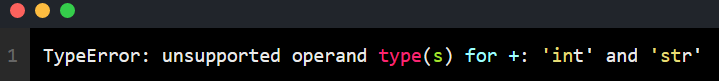
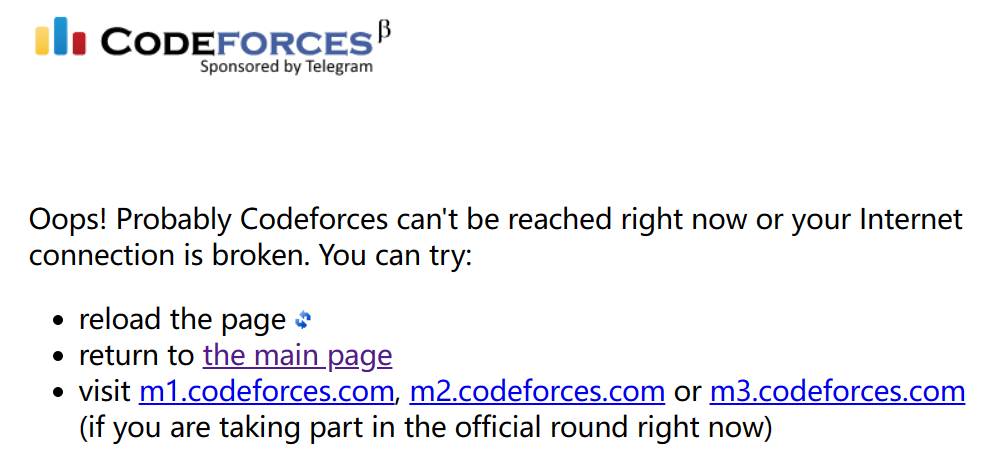

Computer English

library 函数库
footprint     app占用的空间内存
commit  提交
SCM  points to Source Code Management  源代码管理
patch 补丁

build   常见的意思是建造
另一个不常见,作名词但是计算机中常用的意思是       build的东西
在一个project中
Build（构建）通常包含了将源代码转换为可执行文件的整个过程，因此名词build就是指生成的这个可执行文件
常见于app的官网，版本号里面的Build说明这个版本是第几次build完生成的exe，它后面一般跟数字或日期

the most recent maintained build 最新维护的版本(exe)

boot up (of computer) is to start a computer by loading its operating system

kernel is a computer program at the core of a computer's operating system.操作系统的核心程序
译为操作系统的内核
作用：一直在内存中运行

GUI(Graphical User Interface) 图形用户界面   ，这个我知道是啥，我刚才看见user Interface，我翻译成用户接口，用户接口是啥？我搜了一下，翻译为用户界面更容易理解。

disk  磁盘

Windows Explorer integration  windows资源管理器右键菜单
Explorer 资源管理器
integration 集成
add-on 附加组件
changelog post   更新日志的帖子

我刚开始只知道parameter是参数的意思，后来遇到了argument，然后从知乎上得到了答案

> "We will generally use *parameter* for a variable named in the parenthesized list in a function definition, and *argument* for the value used in a call of the function. The terms *formal argument* and *actual argument* are sometimes used for the same distinction."

> ——《The C Programming Language》Section 1.7 K&R

parenthesis 

n.(指语法上的)插入语(成分)

> a word, clause, or sentence inserted as an explanation or afterthought into a passage that is grammatically complete without it, in writing usually marked off by curved brackets, dashes, or commas.

parenthesis指一个单词，一个从句或者一个句子，什么句子呢？被插入到文章里的，inserted into a passage过去分词作后置定语，作为一种解释或者事后的想法(afterthought)。passage是先行词，taht是关系代词，在从句中作主语，说passage没有parenthesis在语法上依旧完整。前面的句子中没有谓语，所有的内容都是在修饰a word，clause，or sentence 这个主语。在逗号之后的句子中，in writing是preposition+noun，这里的writing是write的动名词，marked off 是过去分词形式，作a word，clause，or sentence 这个主语的后置定语。

mark off sth.  by sth. 用sth.划分出来sth.(以标记sth与其他的不同)

dash  破折号

comma 逗号

curve 曲线      curved 弯曲的

bracket  括号

parenthesis是指一个被插入到文章里的，作为一种解释或者时候想法的，一个单词，从句或者句子。去掉之后，文章的语法依旧完整。在书写中，通常用小括号，破折号或者逗号分隔开。

综上，parenthesis在语法上指插入语这个成分。

parenthesis 也指 小括号,就是这个👉()

parenthesize 把……放到括号里，换句话说，就是用括号括起来……

parenthesized  被括起来的……

我们普遍用*parameter*来

parameter 形参
argument 实参

>call
>
>to temporarily transfer control of computer processing to (something, such as a subroutine or procedure)
>
>暂时将计算机执行的控制权移交给subroutine or procedure
>
>A subroutine is **a named section of code that can be called by writing the subroutine's name in a program statement**
>
>指能够被调用的代码块
>
>A procedure is a series of actions conducted in a certain order or manner.

call在汇编层面讲就是跳转到进程标号继续执行，最后return回去。

callable a.可调用的

operand  n.操作数

In mathematics, an operand is the object of a mathematical operation, i.e., it is the object or quantity that is operated on.

I.e. **stands for the Latin *id est*, or 'that is,'** and is used to introduce a word or phrase that restates what has been said previously.What follows the *i.e.* is meant to clarify the earlier statement.

*E.g.* means “for example

synonym n.近义词

one of two or more words or expressions of the same language that have the same or nearly the same meaning in some or all senses

Traversal n.遍历

codeforces上的handle是指用户名username

handle

**a name that someone is known by on the social media**

n.(门)把手

vt.处理

碰见下面三个长得像的单词

codeforces 的 submit

git commit 

还有一个summit

submit

to give or offer something for a decision to be made by others

submit sth. to sb.

把sth提交给sb(，让sb来决定)

还有  屈服、投降、顺从 的意思

commit

**共四种用法:**
*1、* *犯错、犯罪*
*2、* *把……交给……*
*3、* *承诺做某事、坚定不移做某事*
*4、* *在某事上表态*

1. commit是 vt，后跟犯的罪
2. commit sth to sth

summit  n.峰会

峰会指高峰会议，an important formal meeting between leaders of governments from two or more countries

**Oops** 相当于"哎呀”。经常带着“自我吃惊”的意思。有时候也会带抱歉的意思，但是一般来说这个词不能代替真正的抱歉。

index 索引

有两种复数形式：indexes and indices

may,might,could的用法：

1. 表示可能性,可能
2. 表示允许，能够，可以

翻译的时候老是翻译成第一个，然后读着不顺就懵了。

start from scratch  从零开始

command palette  命令面板

get up with  获得

cadence  n.节奏

update cadence 更新频率

"a handful of" 是一个英语表达，意思是一小撮、一小部分或者一些。它常用来表示数量不多或者数量有限的事物。

Telemetry是指通过收集、测量和传输数据来监测、记录和报告远程设备或系统的运行状态和性能的过程。在软件领域，telemetry通常用于收集应用程序或系统的使用数据、错误报告、性能指标等信息，以便进行分析和改进。Telemetry可以帮助开发者了解软件的运行情况、用户行为和问题，并支持对软件进行优化和修复。

seamlessly adv.无缝地

preference 和 reference

偏好                  参考

chord

音乐方面，和弦，是指组合两个及以上的音的音。

计算机方面，组合键，key of chord。

chord有组合的意思

adopt 采用

intuitive a.直觉的

ample a.足够的，丰裕的