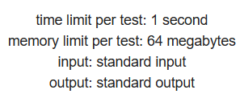

数据单位

一个二进制位是一个**bit**，比特

八个二进制位是一个**Byte**，字节

还有**Word**,等其他的，这些汇编语言会接触到

涉及到计算机存储时，数据单位换算如下：

1B（Byte字节）=8bit
1KB (Kilobyte 千字节)=1024B，
1MB (Mega byte 兆字节 简称“兆”)=1024KB，
1GB (Giga byte 吉字节 又称“千兆”)=1024MB，
1TB (Tera byte 万亿字节 太字节)=1024GB，其中1024=2^10 ( 2 的10次方)，

涉及到网络的传输时，数据单位换算如下：

1kb/s = $10^3$b/s     ----    b/s == bps

1Mbps = $10^3$kbps

1Gbps = $10^3$Mbps

1 Tbps = $10^3$Gbps

在写算法题的时候，会有空间限制，这里的 64 megabytes 是指计算机存储空间，即64MB

