# Web工作流程


浏览器向前端服务器发送请求，前端服务器将请求的前端代码响应给浏览器，浏览器对前端代码进行解析，获得网页框架(无数据)，然后根据前端代码向后端服务器发送请求。后端服务器收到请求之后向数据库服务器请求数据，然后数据库服务器将数据响应给后端服务器进行处理，将处理后的数据响应给浏览器。

前端程序主要是用来进行网页设计。

后端程序主要是进行业务处理的，对接收到的请求进行解析并操作数据库，将获取到的数据进行处理再返回给浏览器的。

写的比较空洞。TODO，以后结合一个具体的代码来看。


本门课主要学习三部分，前端开发，后端开发，数据库。作为后端开发，我们主要学习后端开发和数据库，对前端开发有了解即可。

前端主要内容：HTML、CSS、JavaScript 、Vue、Element、Ngnix

# 前端

[w3school 在线教程](https://www.w3school.com.cn/index.html)

## 网页三剑客

html、css、JavaScript用来设计网页，我们用vscode来编写前端代码，并保存为后缀为html或htm的文件，然后用浏览器打开即可看到我们设计的网页。

### HTML

#### HTML标签

- HTML 标签是由*尖括号*包围的关键词，比如 `<html>`
- HTML 标签**通常**是*成对出现*的，比如 `<b>`  和`</b>`
- 标签对中的第一个标签是*开始标签*，第二个标签是*结束标签*


HTML的所有标签：[HTML 标签参考手册 (w3school.com.cn)](https://www.w3school.com.cn/tags/index.asp)


编写一个简单的HTML程序：

```html
<!DOCTYPE html>
<html>
    <head>
        
    </head>
    <body>
        
    </body>
</html>
```


#### HTML元素

HTML元素指的是从开始标签到结束标签的部分（包括开始标签和结束标签）

例如：下面这一行从 `<p>`到 `</p>` 的闭区间就是一个HTML的元素。

```html
<p>	This is a paragraph	</p>
```

*元素的内容*是开始标签与结束标签之间的内容。

例如，上面那一行中 `	This is a paragraph	`就是这个元素的内容。


标记通常成对出现，但也并不总是这样，如果一个HTML元素只有开始标记而没有指定结束标记，那么就被称为「单标记」、「单标签」、「空元素」。

比如 `<br>`是一个换行符，只有开始标签没有结束标签。

在 XHTML、XML 以及未来版本的 HTML 中，所有元素都必须被关闭。在**XHTML**标准中要求空元素必须使用自闭合标记。

因此，推荐将 `<br>` 写成 `<br/>`。即 对空元素的开始标签使用自闭合标签。


HTML 标签对大小写不敏感：`<P>` 等同于 `<p>`。

推荐使用小写，因为万维网联盟（W3C）在 HTML 4 中*推荐*使用小写，而在未来 (X)HTML 版本中*强制*使用小写。


HTML元素可以进行嵌套。

```java
<html>

<body>
<p>This is my first paragraph.</p>
</body>

</html>
```


**查看网页的前端代码：在网页任意位置鼠标右键，点击查看网页源代码。**


所有连续的空格或空行都会被算作一个空格。


#### 元素的属性

属性提供了HTML 元素的*更多的信息*。

属性总是在 HTML 元素的*开始标签*中规定。

属性总是以键值对的形式存在。 值要由双引号或单引号括起来。


```html
<!-- HTML 链接由 <a> 标签定义。链接的地址在 href 属性中指定 -->

<a href="http://www.w3school.com.cn">This is a link</a>
```


#### 文件路径

可以使用绝对路径或网络链接，但是不建议，用相对路径就好了。

| 路径                             | 描述                                             |
| :------------------------------- | :----------------------------------------------- |
| \         | picture.jpg 位于**与当前网页相同的文件夹**       |
| \  | picture.jpg 位于**当前文件夹的 images 文件夹中** |
| \ | picture.jpg 当前站点**根目录的 images 文件夹中** |
| \      | picture.jpg 位于**当前文件夹的上一级文件夹中**   |

文件路径会在链接外部文件时被用到:

- 网页
- 图像
- 样式表
- JavaScript


### CSS

样式的设置有三种方式：

第一种，使用style属性：

```html
<html>

<body>
    <!--格式：
			 style = "样式:参数"
					比如font-family指的是字体的样式，verdana是具体的某一种字体样式-->
<h1 style="font-family:verdana">A heading</h1>
<p style="font-family:arial;color:red;font-size:20px;">A paragraph.</p>
</body>

</html>
```

第二种：

```html
<html>
<head>
<style>
  h1 {color:red;}
  p {color:blue;}
</style>
</head>
<body>

<h1>这是标题</h1>
<p>这是一个段落。</p>

</body>
</html>
```

`style`标签中存放css代码。

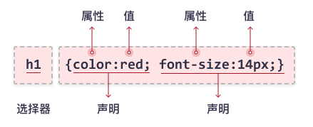

选择器指向您需要设置样式的 HTML 元素。

声明块包含一条或多条用分号分隔的声明。

每条声明都包含一个 CSS 属性名称和一个值，以冒号分隔。

多条 CSS 声明用分号分隔，声明块用花括号括起来。


把 CSS 代码保存在一个单独的文件中，文件的扩展名为 `.css`,在 HTML 文件中使用 `<link/>` 标签链接外部样式表,即 `.css`文件。


```css
<!-- 样式.css -->
h1 {color:red;}
p {color:blue;}
```


```html
<!DOCTYPE html>
<html>
    <head>
    </head>
    <link rel="stylesheet" type="text/css" href="样式.css">
<body>
    <h1>这是标题</h1>
    <p>这是一个段落。</p>

</body>
</html>
```


块级元素是指那些在浏览器显示中占据一行，并且排斥与其他元素统一行的元素。

例子：`<h1>, <p>, <ul>, <table>`

内联元素也叫内嵌元素或行内元素，是指在开发中它会与它的兄弟元素在同一行中从左往右依次排序，不会单独占一行的元素

例子：`<b>, <td>, <a>, `


HTML `<div>` 元素是块级元素。`<div>` 元素没有特定的含义。如果与 CSS 一同使用，`<div>` 元素可用于对大的内容块设置样式属性。因为没有什么特定的含义，可以进行网页排版。

HTML `<span>` 元素是内联元素，可用作文本的容器。`<span>` 元素也没有特定的含义。当与 CSS 一同使用时，`<span>` 元素可用于为部分文本设置样式属性。


类属性和id属性

通过给多个元素定义相同的类名，可以实现渲染这些元素。

```html
<!DOCTYPE html>
<html>
<head>
<style>
.cities {                   /*渲染类名为cities的元素。前面加一个点*/
    background-color:black;
    color:white;
    margin:20px;
    padding:20px;
} 
</style>
</head>

<body>

<div class="cities">   <!-- 给div标签定义了一个类名 -->
<h2>London</h2>
<p>
London is the capital city of England. 
It is the most populous city in the United Kingdom, 
with a metropolitan area of over 13 million inhabitants.
</p>
</div> 

</body>
</html>
```

**HTML id 属性用于 为HTML 元素指定唯一的 id。**

**一个 HTML文档中不能存在多个有相同 id 的元素。**

写一个井号 (#)，后跟一个 id 名称。然后，在花括号 {} 中定义 CSS 属性。

```html
<!DOCTYPE html>
<html>
<head>
<style>
#myHeader {
  background-color: lightblue;
  color: black;
  padding: 40px;
  text-align: center;
}
</style>
</head>
<body>

<h1 id="myHeader">My Header</h1>

</body>
</html>
```


对于html和css的了解就到这了，更多内容去看[w3school 在线教程](https://www.w3school.com.cn/index.html)和网页的源码，看着学就行。


前面学习的HTML和CSS实现页面的布局和各部分的样式。JavaScript使 HTML 页面更具动态性和交互性。

### JavaScript

js引入到html的两种方式：

第一种：定义script标签，在标签内书写js代码。

script标签可以放在html的任意位置，最好放在body标签的底部，可改善显示速度。

您能够在 HTML 文档中放置任意数量的脚本。

第二种：创建一个`.js`文件，文件内存放js代码，在html中通过 script里的src属性指定文件路径，将该文件引入到html中

```html
<script src = ""></script>
```


基本语法：

1. 区分大小写：与Java一样，标识符区分大小写。
2. 每条语句以 `;`结尾。
3. 注释：跟Java一样。


输出语句：

- 使用 `window.alert()` 写入警告框
- 使用 `document.write()` 写入 HTML 输出
- 使用 `console.log()` 写入浏览器控制台


用关键字`var`来声明全局变量，JavaScript是弱类型的语言，变量可以存放不同类型的字面量。

```js
var a = 5;
a = "张三"; 
```

变量的命名规则与Java一样。

变量名可以重复定义。

```js
var a = 5;
var a = 6;
```

代码块：js使用一对大括号来定义代码块，就相当于java里的代码块，只不过js的代码块不受位置限制。

刚才我们说了，用 `var`定义的变量是全局变量。

```js
{
    var a = 5;
}
alert(a);   // 输出5
```

当然我们也可以定义局部变量，在ECMAScript 6 新增了关键字`let`来声明局部变量，只在let声明的代码块内有效。且不允许重复定义。


字面量的数据类型：

```js
var length = 7;                             // number，不管是不是小数，都只有number这一种类型,											//超大或超小的数值可以用科学计数法来写。
var lastName = "Gates";                      // string，单引号或双引号都可
var y = true;                                // boolean
var cars = ["Porsche", "Volvo", "BMW"];         // 数组, object
var x = {firstName:"Bill", lastName:"Gates"};    // 对象, object
```

typeof 运算符

使用 `typeof` 运算符返回变量或表达式的类型

```js
typeof ""                  // 返回 "string"
typeof "Bill"              // 返回 "string"
typeof "Bill Gates"          // 返回 "string"
```

Undefined

在 JavaScript 中，没有值的变量，其值是 `undefined`。typeof 也返回 `undefined`。

```js
var person;                  // 值是 undefined，类型是 undefined。
var p = null;              // null的类型本应该是undefined，但是由于早期bug没有修复，一直延续至今，                             //null的类型是object
```

变量可通过设置值为 `undefined` 进行清空。其类型也将是 `undefined`。

```js
person = undefined;          // 值是 undefined，类型是 undefined。
```

函数的类型就是function

```js
typeof function myFunc(){}   // 返回 "function"
```

函数定义：

```js
function name(参数 1, 参数 2, 参数 3) {
    要执行的代码
}


var 函数名 = function (参数 1, 参数 2, 参数 3) {
    要执行的代码
}
```

函数调用：

```js
function toCelsius(fahrenheit) {
    return (5/9) * (fahrenheit-32);
}
// 上面定义了一个函数，下面 等号右边   toCelsius(77) 是函数调用。
document.getElementById("demo").innerHTML = toCelsius(77);
// 下面等号右边  toCelsius 没有() ，返回的是函数的定义。
document.getElementById("demo").innerHTML = toCelsius;
```

在 JavaScript 函数中声明的变量，会成为函数的*局部变量*。

```js
// 此处的代码不能使用 carName

function myFunction() {
    var carName = "Volvo";
    // 此处的代码可以使用 carName
}

// 此处的代码不能使用 carName
```

对象：有键值对，有方法。

```js
var person = {
  firstName: "Bill",
  lastName : "Gates",
  id       : 678,
  fullName : function() {
    return this.firstName + " " + this.lastName;
      //在函数定义中，this 引用该对象。
  }
};
```

访问对象成员的方法： `对象名.属性名`

运算符：

与java的运算符一样的，就是多出来一个  `===`全等运算符，只有数据类型和值都相等了才返回true


基础语法太多了，了解即可。后端不会编写的，能看懂就行，看不懂就搜。


**JSON 是存储和传输数据的格式。**

**JSON 经常在数据从服务器发送到网页时使用。**

**JSON是文本**。

JSON的格式：

```js
var a = '{"key":value,"key":value}';
```

因为JSON是文本，即字符串，等号右边就是一个JSON文本。用单引号括起来，然后接一个大括号。大括号的每一个元素是一对键值对，键用双引号引起来。


JSON字符串与js对象的转换：

这个必须学，不学这个的话，就没办法进行数据传输了。

`JSON` 对象提供了两个主要方法：

1. `JSON.stringify()`：将 JavaScript 对象转换为 JSON 格式的字符串。
2. `JSON.parse()`：将 JSON 格式的字符串转换为 JavaScript 对象。

```js
const person = {
  name: "John",
  age: 30,
  city: "New York"
};

const json = JSON.stringify(person);
console.log(json); // 输出：{"name":"John","age":30,"city":"New York"}
```

```js
const jsonString = '{"name":"John","age":30,"city":"New York"}';

const person = JSON.parse(jsonString);
console.log(person); // 输出：{ name: 'John', age: 30, city: 'New York' }
```


如果js对象中含有函数成员，在转为JSON的时候会怎么办呢？


BOM：浏览器对象模型

js将浏览器的各部分封装成对象。以下是提供的BOM对象。

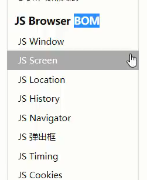

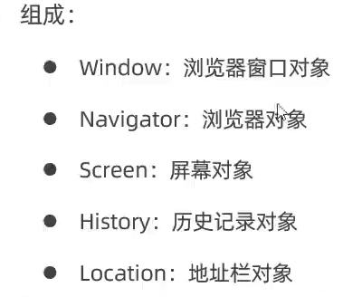

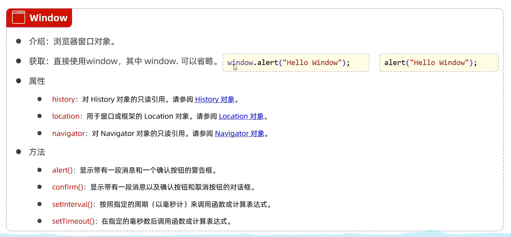

直接使用`window.属性或方法`调用window对象的属性或方法。

alert()方法见过就不说了。

下图是confirm()方法的一个应用。


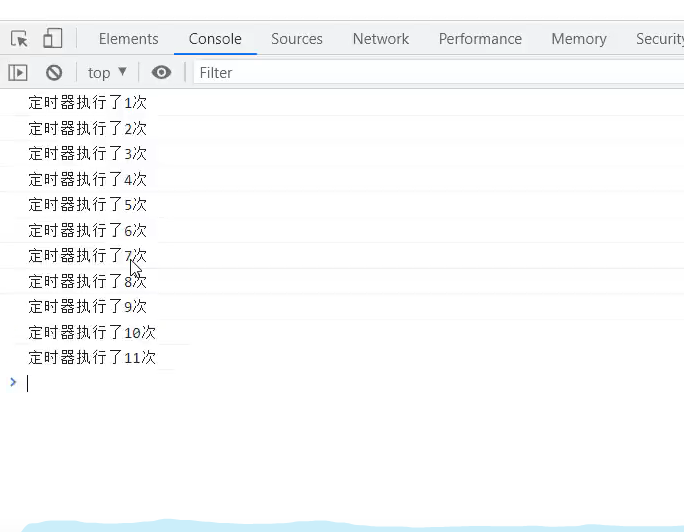


第一条语句会弹出警告框，内容是当前地址栏的地址。第二条语句是设置当前地址栏的地址。在点完警告框的确定按钮后，会跳转到所指定地址的网页。


DOM

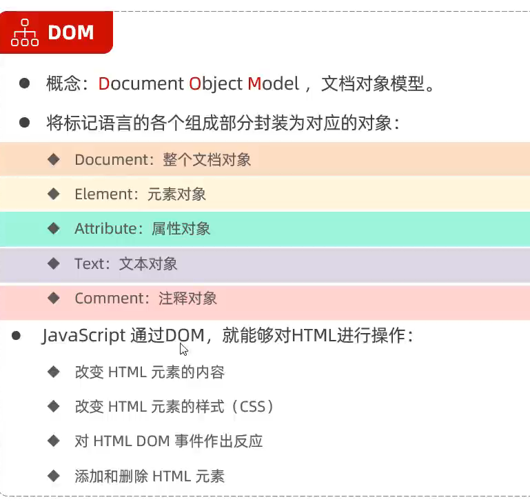

举个例子；

通过事件绑定按钮，`删除最后一个`按钮点击后，会删除最后一条记录对应的html代码。js在该绑定事件中定义了事件：先获取最后一条记录对应的元素对象，然后删掉。

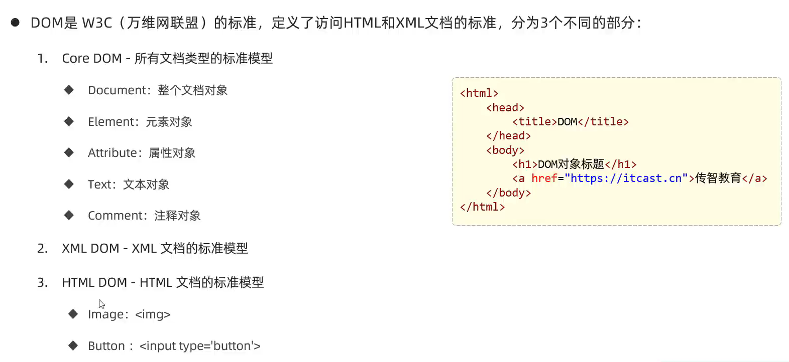


[Day02-12. JS-对象-DOM案例_哔哩哔哩_bilibili](https://www.bilibili.com/video/BV1m84y1w7Tb?p=26&vd_source=5a374f315281b0338a0b7fd69b8b8e98)


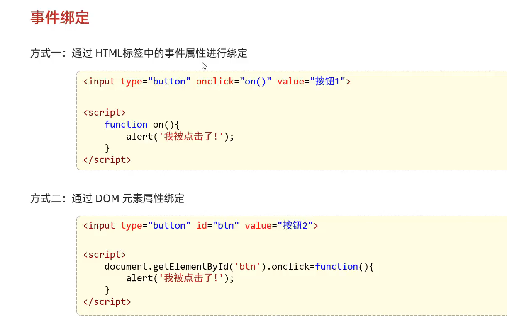

第二种方法：先获取到id为btn的input元素对象，然后给它的属性onclick赋方法。onclick是鼠标点击事件。


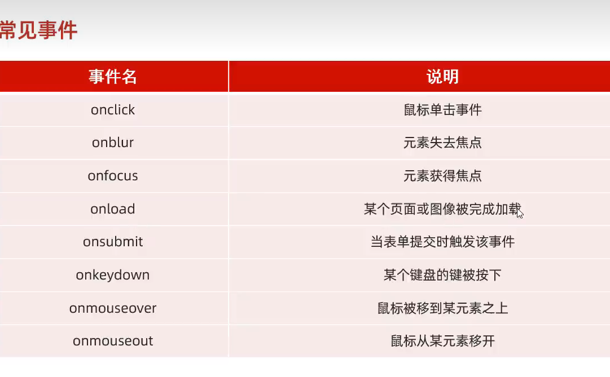

获得焦点的意思就是鼠标移动到该元素上。


三剑客基础的内容已经了解的差不多了，依靠着那个教程网站，找几个项目跟着做。才能消化。

可以去找专门前端课系统学。

## Vue


dom是用来操作html元素的，能够实现动态网页的效果。

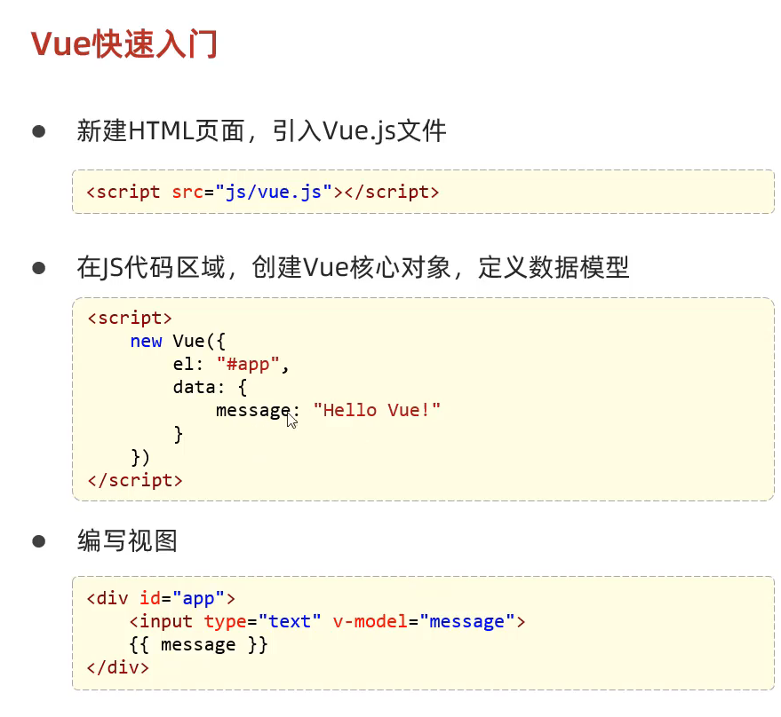

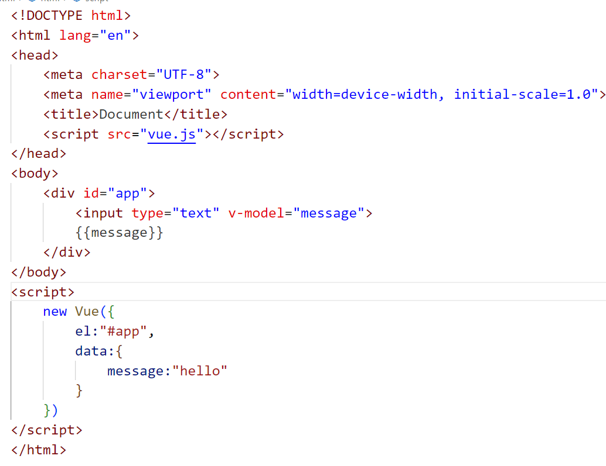


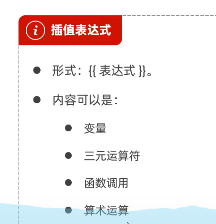


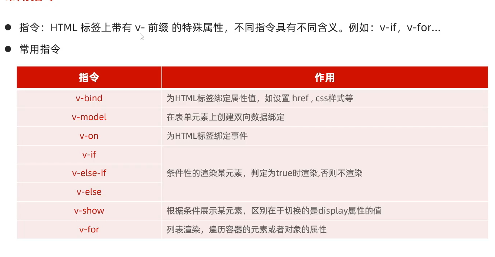

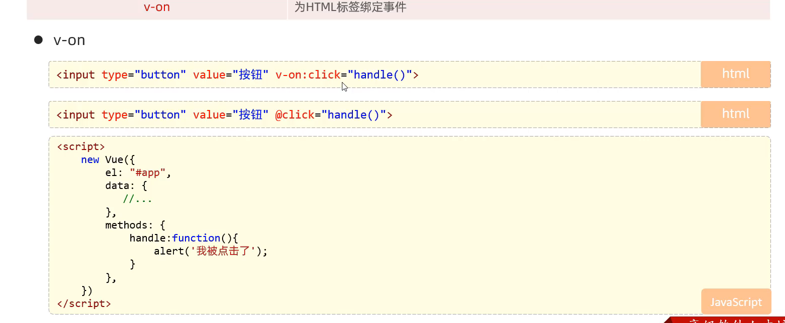

通过dom操作的话，如果要对一个元素标签进行多次dom操作，每次操作都要先获取对象。。。

而使用vue，对于一个元素标签的话，只需创建一个Vue对象，然后用el属性绑定，再在Vue对象中定义属性和方法就行了。

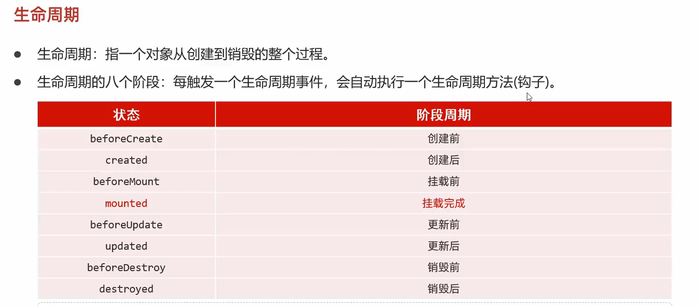


在上述位置定义钩子方法， 生命周期到的时候，自动执行钩子方法。


在挂载完成后，会自动执行钩子方法，此时在该方法里需要使用axios请求获取数据。


提醒就是异步交互。

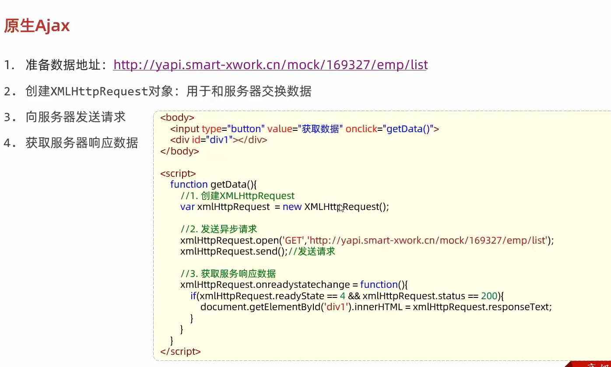

这个数据地址就是后端服务器返回的，这里的是用YApi平台创建的。


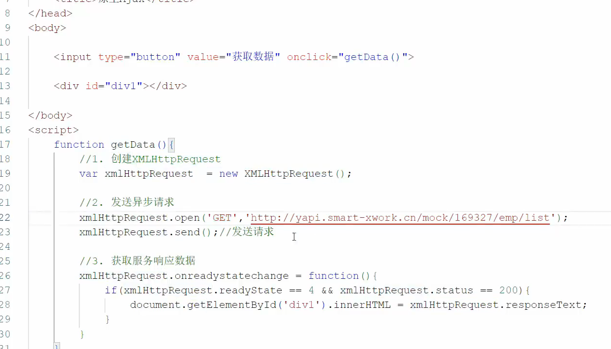


ajax比较繁琐，因此我们 学axios

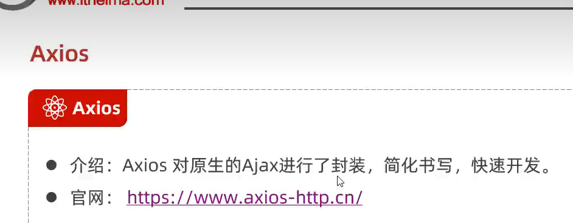

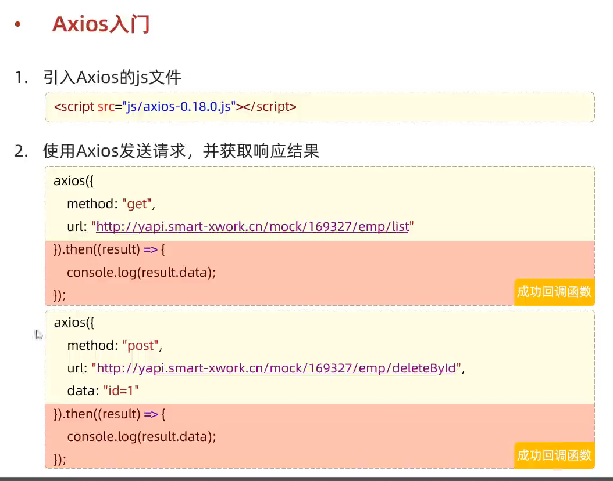

定义一个axios对象，然后里面定义一个对象，对象的第一个属性是method，表示请求的方式，第二个属性url表示请求的地址。

然后通过axios对象.then() ，then()的括号里是一个方法，这个方法称为成功回调函数，即服务器成功响应回来数据之后自动调用的方法。

上面的方法形式是箭头函数。

`(result)=>{console.log(result.data)}`

result是形参，`result.data`里面存放的是返回回来的数据。

在请求为post时，需要在对象中额外定义一个data属性，对应的值是传递的请求体。

以下是进一步简化：


[Day03-02. Ajax-Axios2_哔哩哔哩_bilibili](https://www.bilibili.com/video/BV1m84y1w7Tb?p=35&vd_source=5a374f315281b0338a0b7fd69b8b8e98)

在这个视频的后面有一个案例，介绍了基于vue和axios完整实现了获取数据以及动态编写html。


先学网页三剑客、vue，前面学的数据都是在本地，如果数据存放在服务器中，通过ajax，写出url、请求方式

然后学网络部分内容，然后http协议，然后ajax、yapi，element这样前端就打通了。

[2.2 键入网址到网页显示，期间发生了什么？ | 小林coding (xiaolincoding.com)](https://xiaolincoding.com/network/1_base/what_happen_url.html#孤单小弟-http)

[Day03-03. 前端工程化_哔哩哔哩_bilibili](https://www.bilibili.com/video/BV1m84y1w7Tb?p=36&vd_source=5a374f315281b0338a0b7fd69b8b8e98)yapi

# 后端

maven

