前后端分离开发

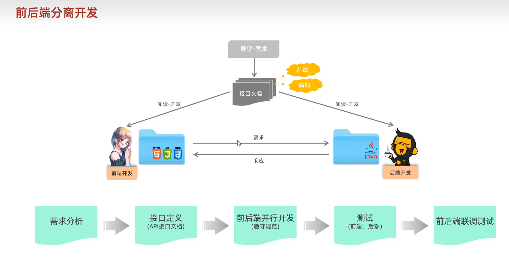

产品经理根据客户需求进行需求分析，设计出静态html页面的产品原型，同时详细说明了每部分的要求。然后从中抽离出接口文档，前端开发和后端开发根据接口文档进行开发。

接口文档的编写有在线和离线两种方式。在线是利用一些在线平台编写。离线是使用本地的word，markdown等编写。**YApi就是一个在线的接口文档管理平台**。

下面是产品原型。

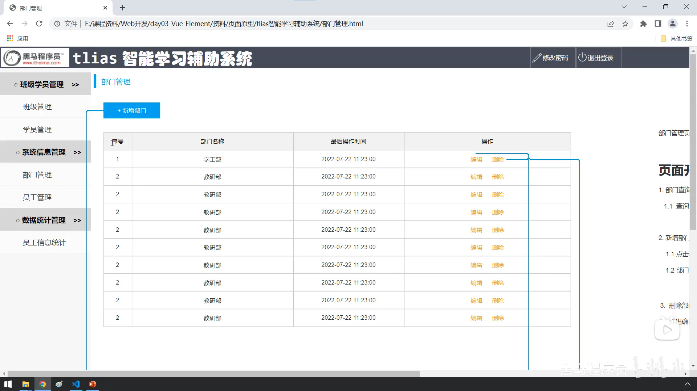

接口文档示例：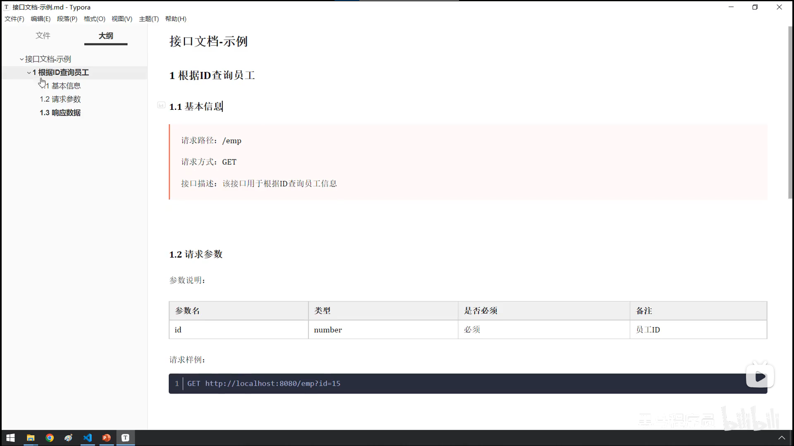

这个接口文档中，定义了 根据ID查询员工 这个接口的基本信息，请求参数，和响应数据的格式。

YApi接口管理平台的两大特色：

API接口管理，就是用于定义接口文档的。

Mock服务能够模拟真实的接口，用于前端工程的测试，这样就不用等后端开发完成，从而前后端可分离。

YApi的使用：

首先登录，然后创建一个项目，一个项目就对应一个具体的系统，比如餐饮管理系统。然后添加一个分类，一个分类就对应系统的一个模块。比如外卖系统有多个模块，用户管理，员工管理等等。然后就可以创建该模块下的接口了。

接口设置有三个部分：基本信息，请求参数，返回数据格式。

在设置好以后，会生成一个mock地址，前端通过axios可以向该地址发送请求。

前端工程化：

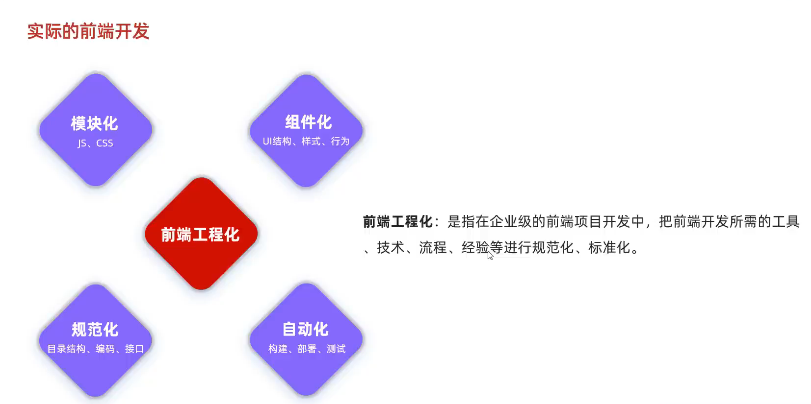

模块化：将js、css封装成一个一个可以复用的模块。

组件化：将UI结构、css样式、js行为封装成一个个组件，便于管理。（**这个有点不知所云**）

规范化：提供一套规范的目录结构及编码规范。所有开发人员根据统一的标准进行开发。

自动化：项目的构建、部署、测试都可以自动完成。（**不太了解**）

前端工程化可以提升前端开发效率。

反正，以后前端开发第一步就是先创建一个前端工程呗。

通过vue-cli可以实现前端工程化。

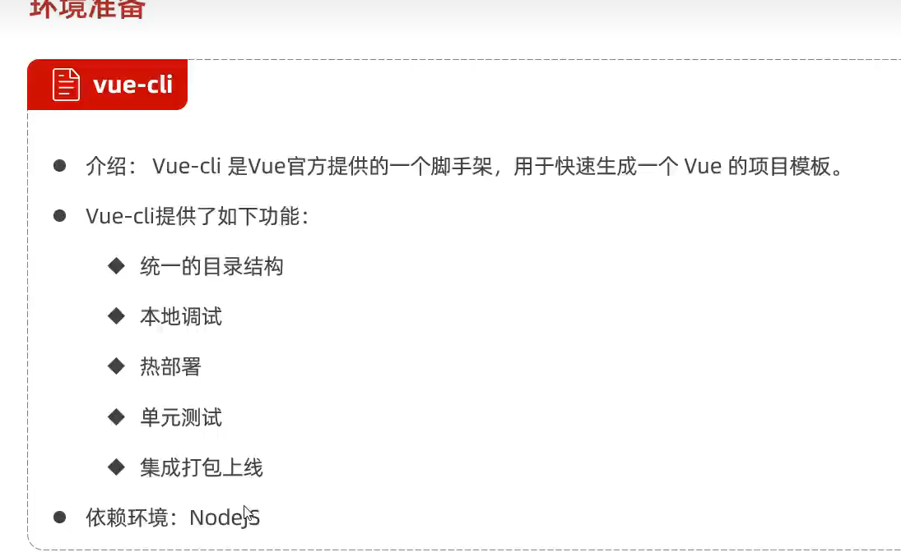

NodeJS是js的运行时环境。运行环境：就相当于java的JDK=JVM+核心类库。java程序运行不可缺少的东西。

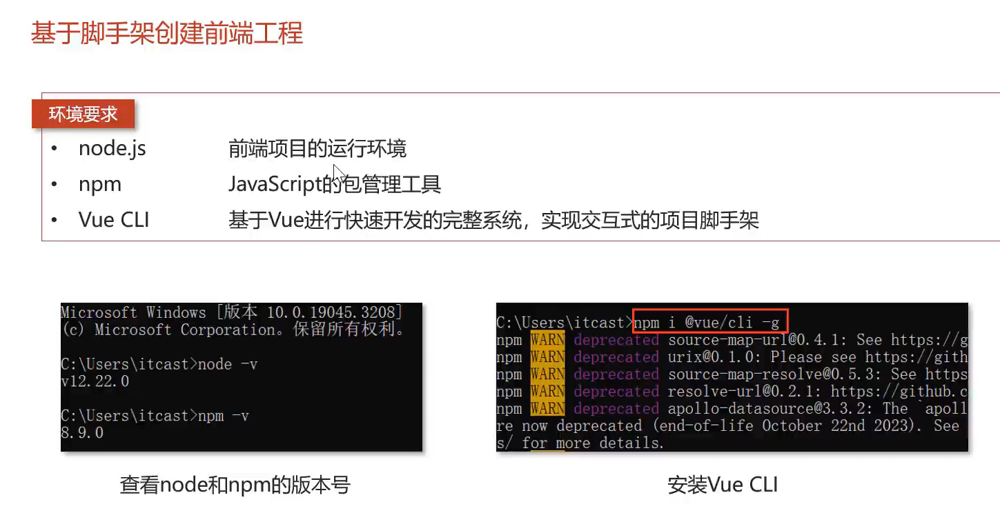

npm 是随同 Node.js 一起安装的包管理工具，我们经常使用它来下载第三方包到本地。

[NPM 全局安装与本地安装的区别 ](https://www.cnblogs.com/apollo1616/articles/10055602.html)

在安装前配置一下镜像，不然安装太慢。

`npm i @vue/cli -g`

npm表示执行npm命令。后面都是npm的参数。

i表示install  

@后面的是要安装的包的名字。

-g 表示全局安装。

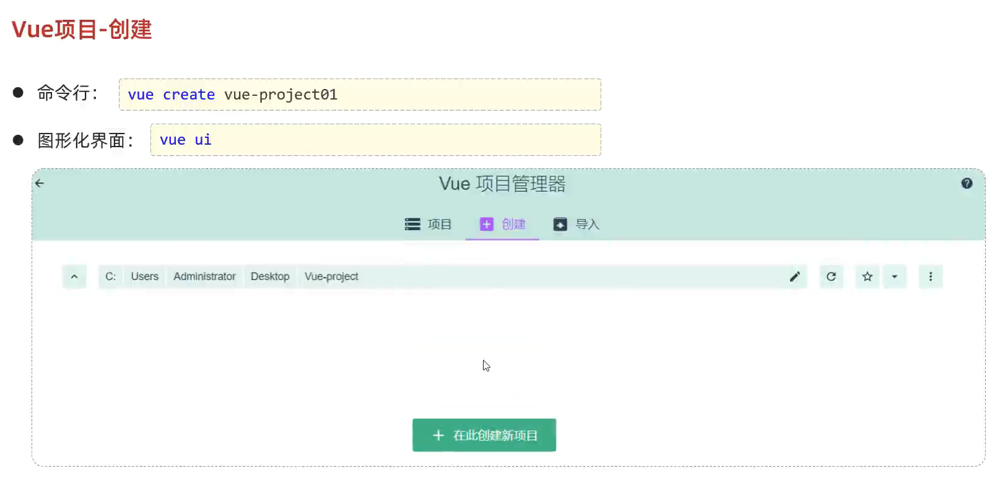

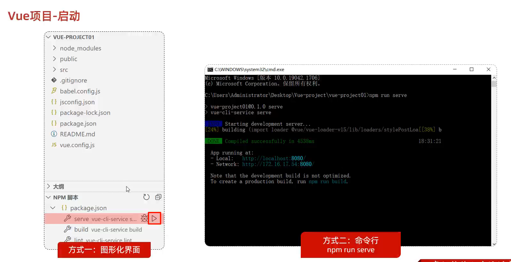

我没有找到npm脚本，用第二种方式，在vscode新建cmd（不是powershell），然后输入 `npm run serve`,等待启动完成，就可以访问该项目。

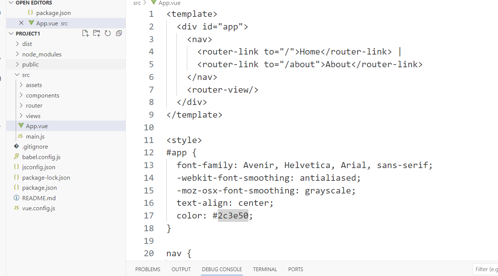

后面的tomcat也会占用8080端口，因此这里改一下。

Vue的开发流程：

一个vue文件就是一个组件，模板部分用于生成html代码，即定义该组件的布局。script部分用于编写vue代码和axios代码，获取数据和控制模板部分的html，即实现动态效果。

css样式部分就是样式。

在一个Vue项目中，有一个App.vue文件，这个文件被称为根组件。

因为我们启动Vue项目之后访问的页面是public文件夹下的index.html文件

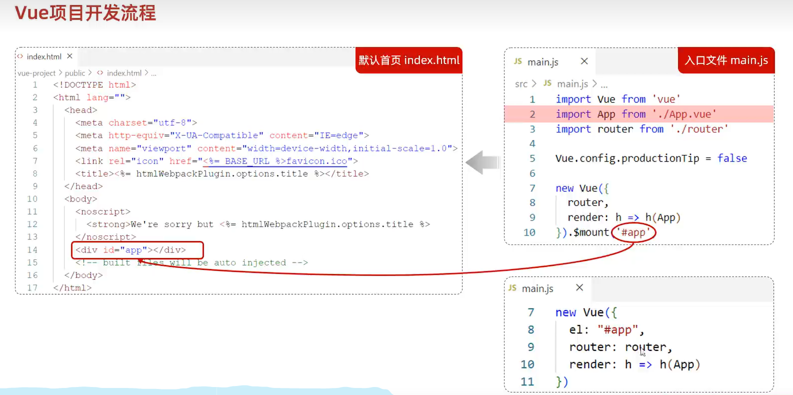

这个文件会自动引入main.js文件。

这个js文件中的import语句

`import App from './App.vue'`表明，引入该组件'./App.vue'，并定义别名为App.

同时定义了一个Vue对象，定义了mount方法，这个写法就相当于下面的`el:"#app"`

同时`router:router`简写成了`router`

`render: h=> h(App)`表明将App组件挂载到index.html中id为`app`的div元素中。因为主页是index.html，只有一个div标签，而这个标签显示的是App.vue组件。即主页显示的是App.vue组件，我们可以通过多定义几个组件，然后引入到App.vue组件中就可以自定义该项目网页了，所以App.vue被称为根组件。

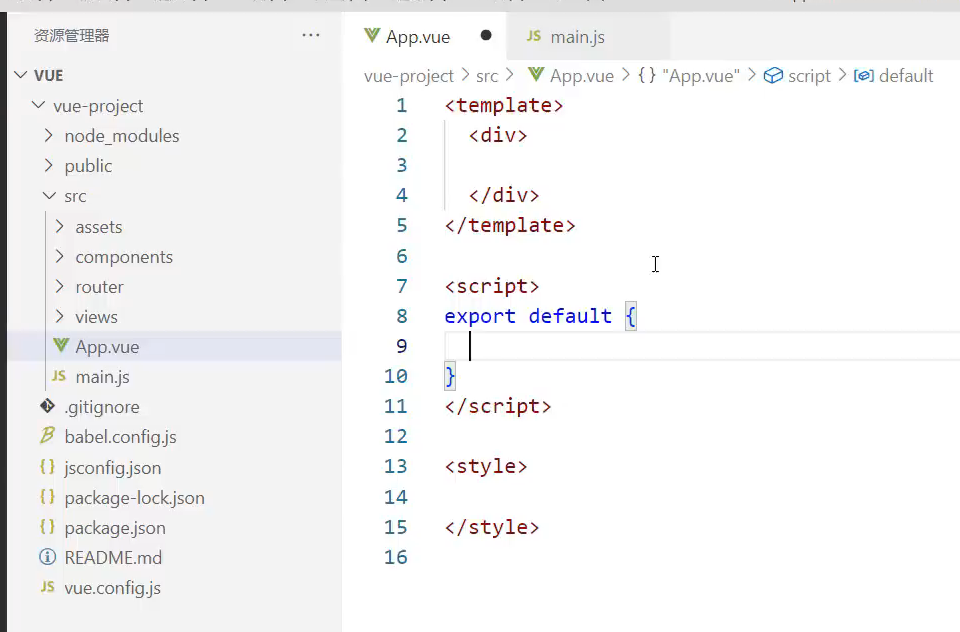

我们不用动index.html和main.js，只需动App.vue即可。上面是模板，我们在模板里添内容即可。

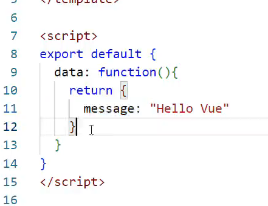

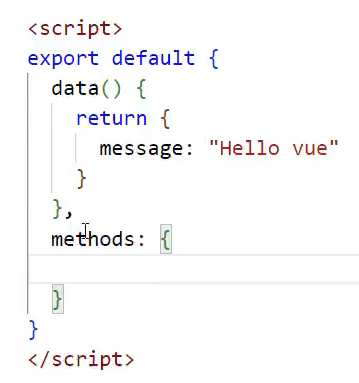

这个script里面的部分差不多可看出跟Vue对象的结构差不多。

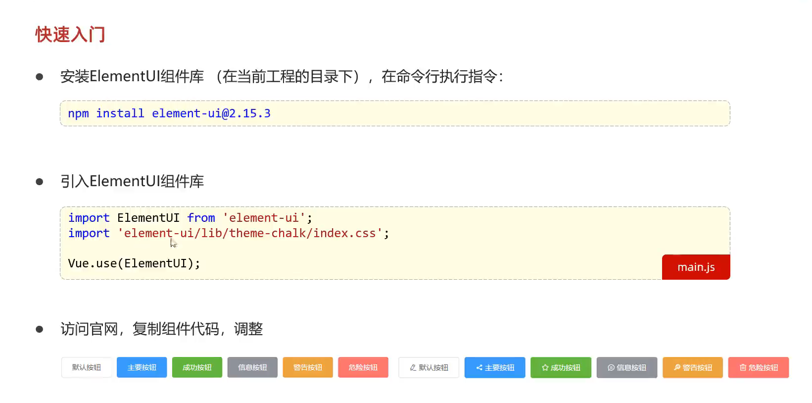

注意路径，安装在了该项目的node_modules文件夹下，这个文件夹是存放该项目的依赖的。

我们对Vue项目的开发，主要在两方面，第一方面，组件的制作，即vue文件的制作，我们借用element可以创建各种各样的vue文件（组件），存放在views文件夹中。第二方面，将这些组件引入且编排到根组件中。

首先是快速入门https://www.bilibili.com/video/BV1m84y1w7Tb?p=40

然后是常见的组件：[Day03-08. Element-组件-Table表格_哔哩哔哩_bilibili](https://www.bilibili.com/video/BV1m84y1w7Tb?p=41&vd_source=5a374f315281b0338a0b7fd69b8b8e98)

表格、分页、对话框、表单

然后是案例：[Day03-12. Element-案例-基本页面布局_哔哩哔哩_bilibili](https://www.bilibili.com/video/BV1m84y1w7Tb?p=45&vd_source=5a374f315281b0338a0b7fd69b8b8e98)基于Vue项目、element组件、axios实现精美的网页。

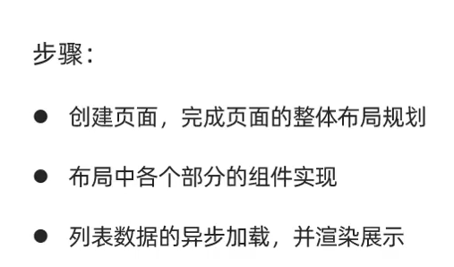

vue路由：[Day03-15. vue路由_哔哩哔哩_bilibili](https://www.bilibili.com/video/BV1m84y1w7Tb?p=48&vd_source=5a374f315281b0338a0b7fd69b8b8e98)

前端最后一步，将Vue项目打包部署：

前端最为流行的服务器软件Nginx

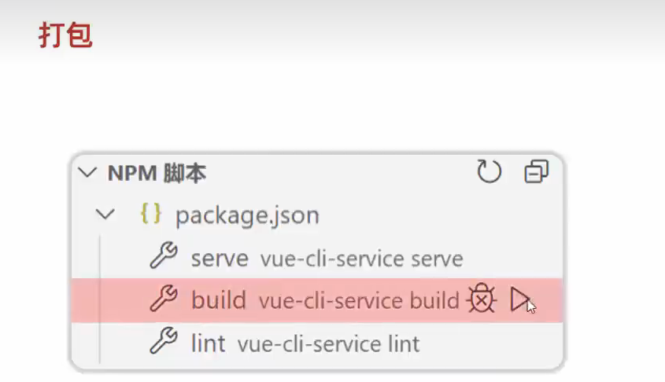

或者cmd中输入`npm run build`就实现了打包，打包完成后，在dist文件夹中。

经过上述步骤，假设我们有一台linux服务器，然后实现Vue项目，再通过YApi平台创造后端数据，axios实现数据请求。然后部署到linux服务器上。就可以通过任意电脑访问该网页了吧。

苍穹外卖前端开发课程

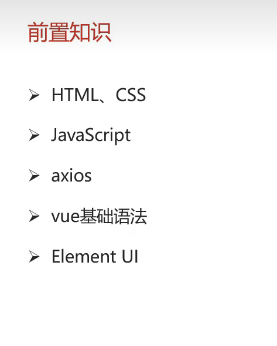

跟着苍穹外卖前端课程完成一个案例即可。

