后端

maven

管理和构建java项目的工具。

了解完maven之后，接下来是spring boot项目的创建，创建完成之后，编写一个请求处理类，然后在该类中定义接收某一请求的处理方法。@RestController ，处理方法的返回值（数据）会返回给浏览器。

**在创建Spring Boot项目的时候，需要引入web依赖，这个依赖的功能是实现与前端的交互，即接收请求和发送响应。**

http协议：

浏览器向服务器发送请求，发送的这个`请求数据`的格式是固定的。同时服务器响应浏览器，这个`响应数据`的格式也是固定的。这个格式就是http协议的。

打开开发者工具F12，点击网络，可以查看所有的网络请求。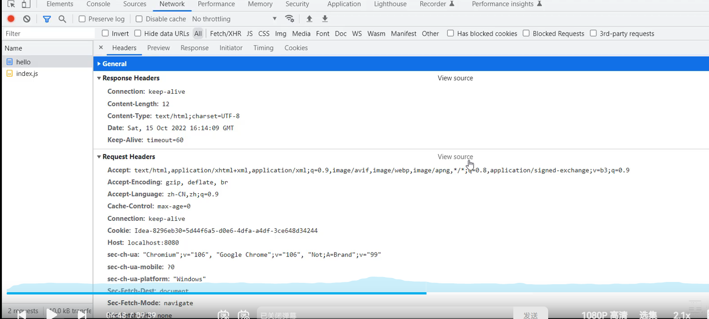

response headers表示`请求数据`。`request header`表示`响应数据`

点击View source可以看原始的数据格式。就是一个文本字符串。浏览器和服务器会根据http协议去解析原始的数据。

http协议的特点：

请求数据的格式：

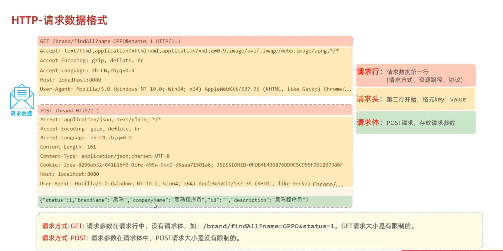

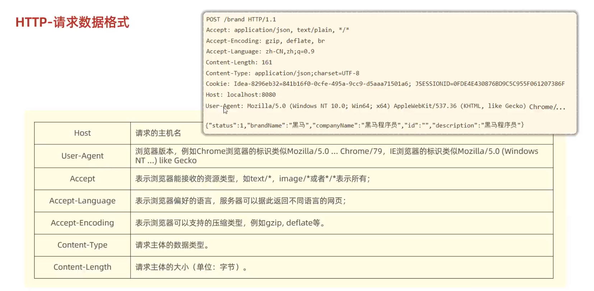

http协议的解析：

服务器和浏览器都需要解析http协议，因为浏览器内置了解析http协议的程序，我们不需要操作。

在服务器端，我们可以通过 我们在javase课程当中学的网络编程部分，实现解析http协议的程序。tomcat服务器软件已经实现了http协议的解析程序。我们不用再管了。

因此，我们把后端程序部署在tomcat上，然后浏览器就可以访问了，因为tomcat已经实现了http解析程序。

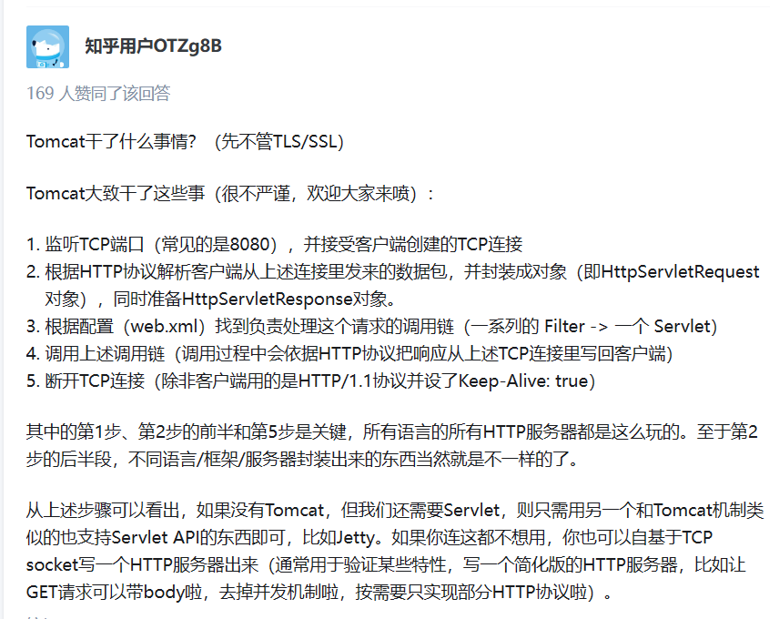

从上述可知，tomcat会建立tcp连接，并接收发送http格式的请求数据和响应数据。

接收到的数据会被封装成HttpServletRequest对象，同时准备一个HttpServletResponse对象用于封装响应数据。然后根据web.xml找到调用链获得响应数据，封装到HttpServletResponse对象中，然后再发送给浏览器。

我们上面学习了http协议，在请求数据中，请求的方式有多种，如get、post等。在浏览器的地址栏输入地址发送是get请求。如果后端需要接收post请求就只能要求前端程序员写一个axios，来发送post请求。为了避免这样。

我们学postman，postman可以模拟前端，从而发送各种各样的请求。来满足后端的需求。

postman与YApi平台，异曲同工之妙，恰恰相反。YApi平台可以模拟后端接口，前端发送请求，从而获得后端数据。postman可以模拟前端发送请求，后端接口进行响应。

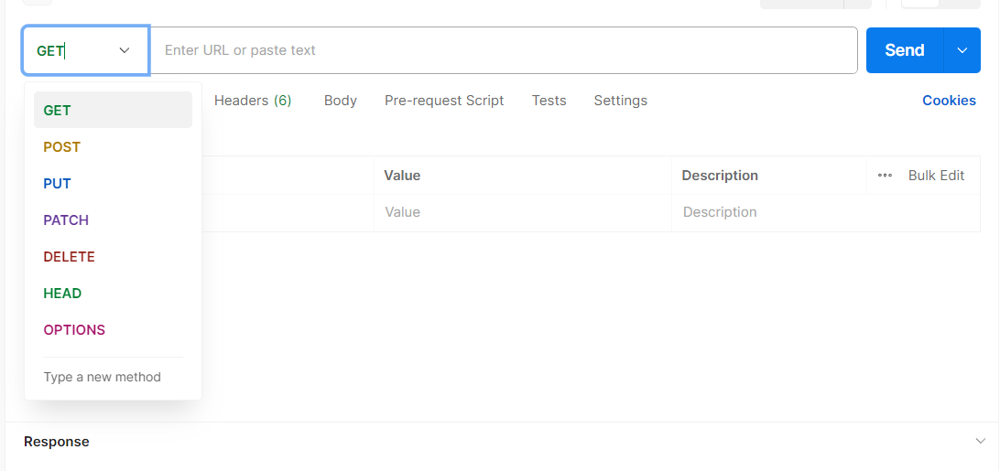

看，有这么多的请求方式。

在一个请求里，可以设置请求的方式，路径，参数(Params)，请求头(Headers)，请求体(Body)

设置好请求之后，点击send，就会将该请求发送到对应的服务器。

参数的接收：

简单参数的接收：这里指的是get请求方式在`Params`那一栏设置的参数。

接收的方式如上：tomcat监听8080端口，建立tcp连接，然后将监听到的请求封装到HttpServletRequest对象request当中，然后通过getParameter("KEY")方法获得KEY对应的VALUE值。

上面的方法是通过tomcat提供的HttpServletRequest类实现的，比较繁琐，既需要通过调用方法获得值，又要进行类型转换。基于Spring Boot方式可以简化上述操作，即下面的方式。

下面的post请求，将参数写到了Body，请求体当中。依旧是同样的接收方法。

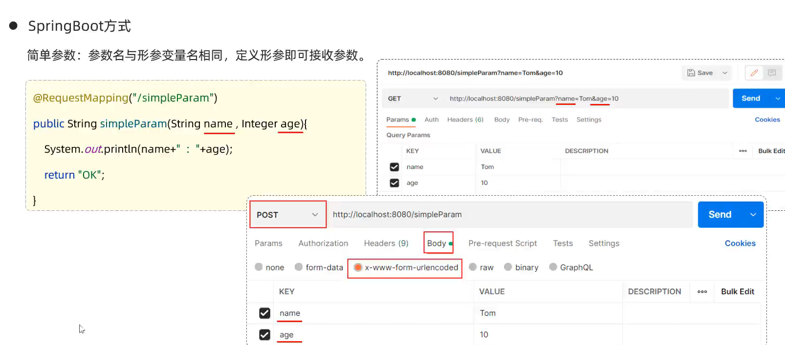

当请求参数与接收方法中的接收参数的名字不一样的时候，会出现错误。这个时候可以通过映射修正。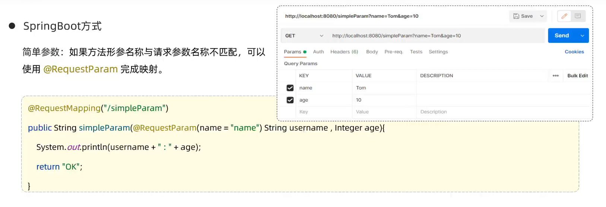

required参数为false，意味着name这个参数，浏览器端传不传都可。如果不设置的话，如果浏览器端没有传递name参数会报错的。

下面是将请求参数给封装到一个bean对象中去了，代码更简洁。

此时

看这个结构，pojo文件夹存放bean对象，controller文件夹存放请求处理类。这玩意儿实现了数据和逻辑处理的分离。

pojo什么意思？Plain Old Java Object（普通Java对象）所描述的是一个简单的类型，没有任何特定框架的引用。这个类可以被任何Java程序使用，因为它不绑定到任何框架。但是，我们没有遵循任何真正的约定来构造、访问或修改类的状态。这种缺乏惯例的做法造成了两个问题：

1）如何使用它需要理解一下。

2）它可能会限制框架对其支持约定而不是配置、理解如何使用类以及增强其功能的能力。

JavaBean仍然是一个POJO，但围绕如何实现它引入了一组严格的规则：

访问级别—要求属性是私有的，并暴露公开getter和setter方法。
方法名–getter和setter遵循getX和setX约定（对于布尔值，isX可以用于getter）
默认构造函数–必须存在无参数构造函数，以便在不提供参数的情况下创建实例，例如在反序列化期间

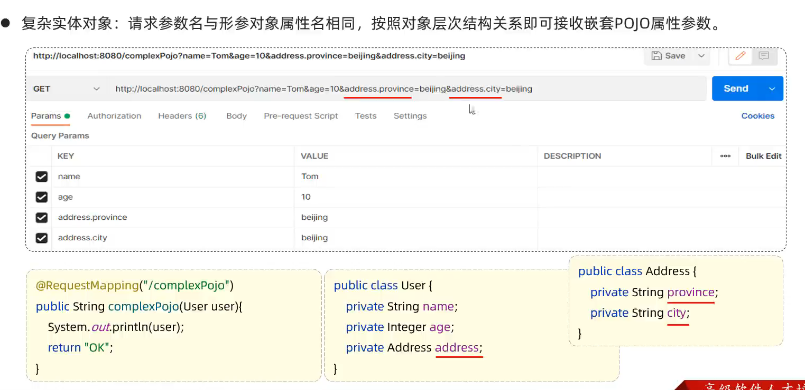

复杂实体对象.....看图不难理解。

数组参数的接收：

将接收的参数封装到数组中👇

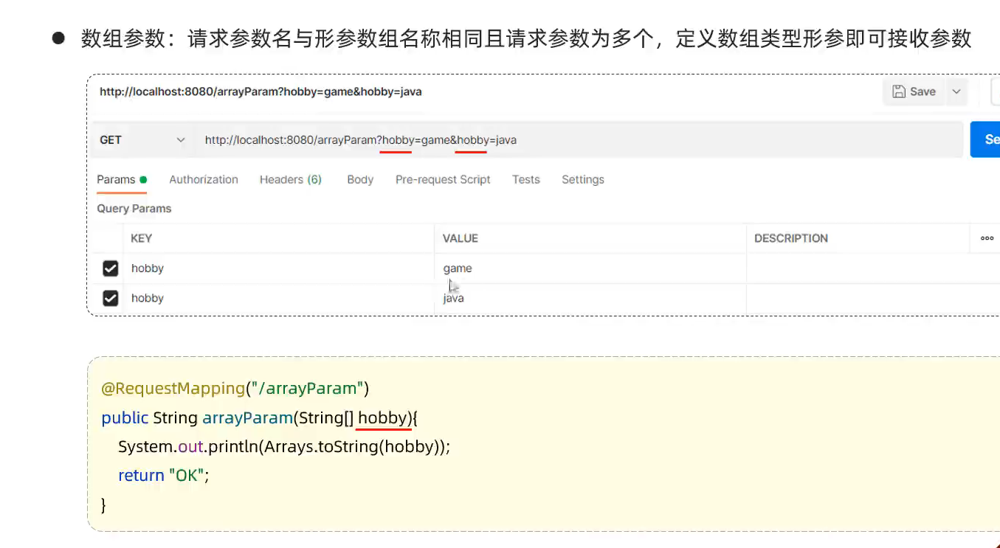

将接收的参数封装到集合中👇

@RequestParam的作用：因为默认情况下会将接收的参数封装到数组当中的，声明该注解意味着要将接收的参数封装到集合中。

应用场景：Form表单里有个活动性质。这是个复选框（多选框）。

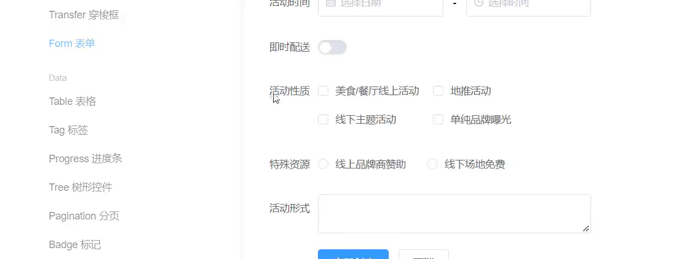

JSON参数：

在请求中设置JSON参数的方法👇

JSON参数的接收：

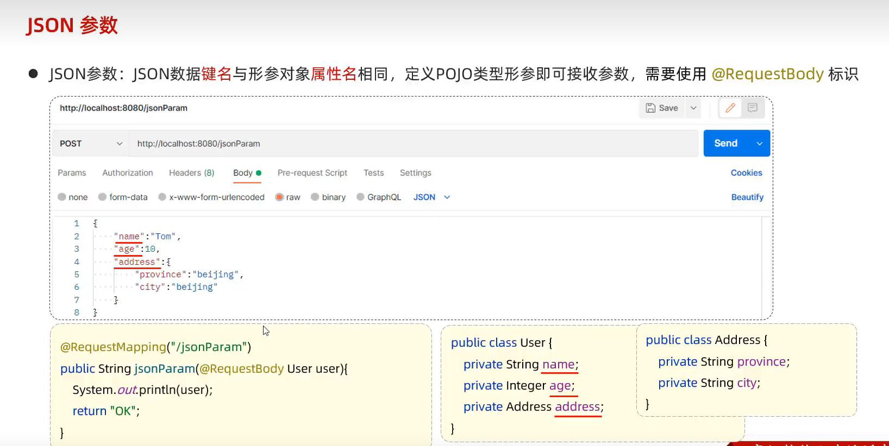

日期参数：

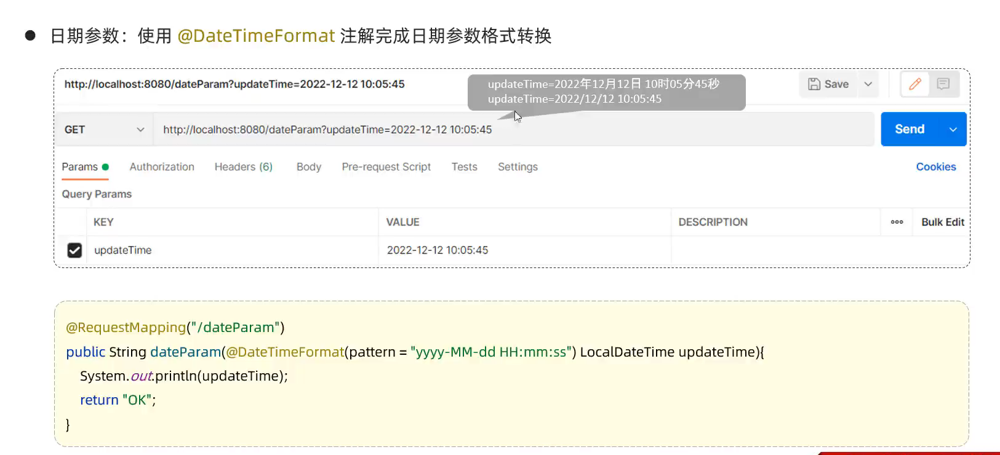

在处理方法中有一个参数pattern，这个是声明接收的日期参数的格式的。只有日期参数是这个格式的，才会被这个方法接收。

日期参数的格式上面的灰色方框里有举了两个例子。

路径参数：

传递单个参数：

传递多个参数：

响应：

在第一个例子中，我们响应的数据是交给return了的。这是怎么实现的呢？是使用@ResponseBody注解实现的。

下面是对该注解的介绍。

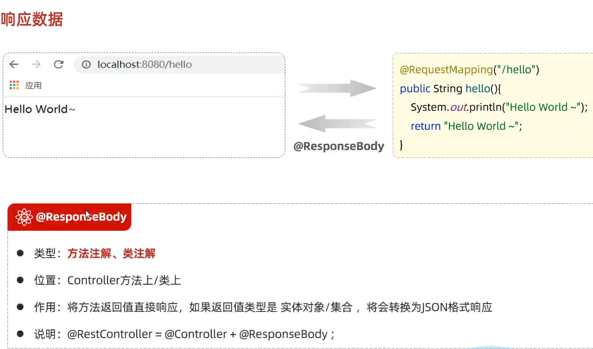

但是我们在该例子中并没有使用到@ResponseBody注解啊。原因是因为

我们用@RestController注解定义该类为请求处理类，这个@RestController注解的定义如下：

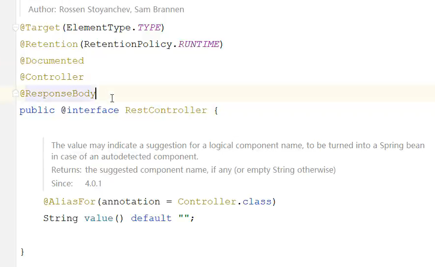

这个注解被@Controller和@ResponseBody修饰。

被@ResponseBody修饰的类，的所有方法的返回值都会返回给浏览器。

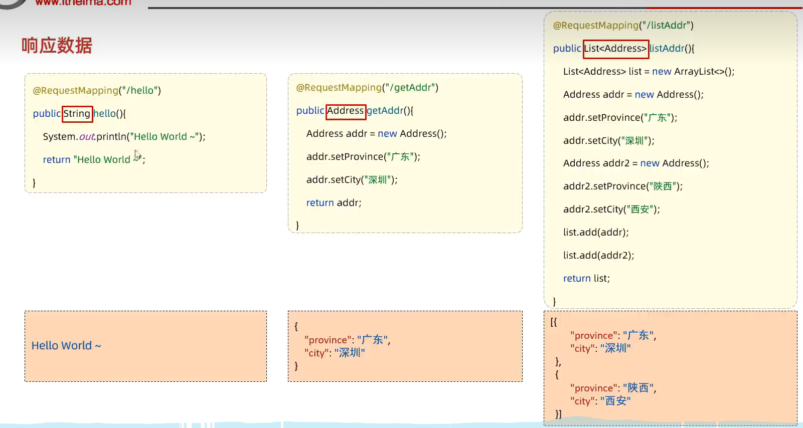

不同的方法响应的数据格式不同，为了统一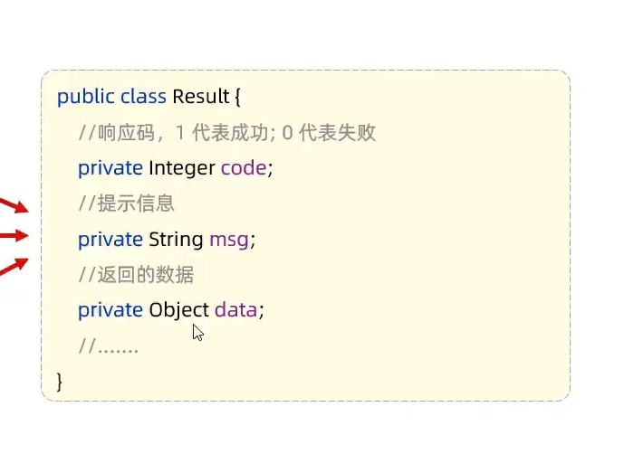

定义了一个统一的响应格式👆。将上述的数据封装到Object类对象data中。

下面定义了一个Result类。

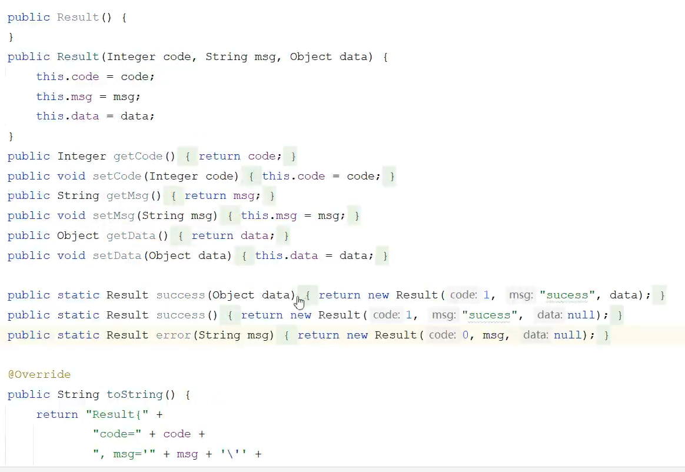

学到P74了