# 基础


下面有两个案例，第一个是age 如何声明为TINYINT UNSIGNED

第二个是score是总长度为4，保留一位小数的double类型。


用的最多的是CHAR和VARCHAR，在定义的时候都需要指定最大长度。

对于定长字符串CHAR，适于存储性别，只有0或1

对于变长字符串VARCHAR，适于存储用户名等。


一般用DATE、TIME、DATETIME

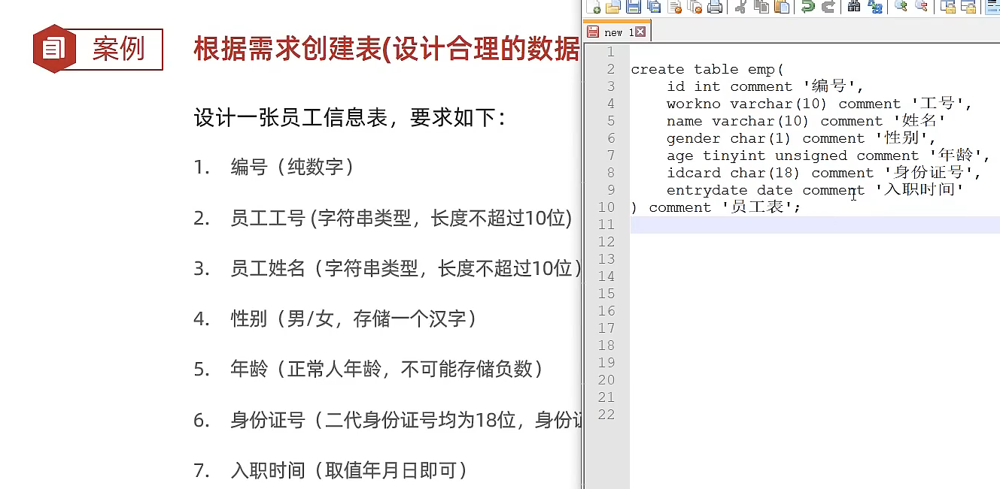

## DDL

对数据库、表、表结构进行操作

对数据库操作

```mysql
show databases;    - 显示所有数据库
create database [if not exists] 数据库名; -[如果不存在该数据库]就新建数据库
use 数据库名; -切换到该数据库，接下来的sql语句都是针对该数据库的
select database();    - 在上面那条语句执行后再执行该语句可以查看当前使用的数据库
drop database [if exists] 数据库名; -[如果存在该数据库]删除数据库
```

对表操作

```mysql
show tables;  -- 查看当前数据库所有的表
create table 表名(
	字段1 字段1类型[comment 字段1注释],
	字段2 字段2类型[comment 字段2注释],
    字段3 字段3类型[comment 字段3注释]
)[comment 表注释];                        -- 创建表
desc 表名;  -- 查看表结构
show create table 表名;     -- 查看建该表的语句
drop table [if exists] 表名;  -- [如果表存在的话]删除表
truncate table 表名;    -- 清空该表
alter table 表名 add 新字段 新数据类型 [comment 注释] [约束];  -- 添加新字段
alter table 表名 rename to 新表名 [comment 注释] [约束];    -- 修改表名
alter table 表名 drop 字段名;         -- 删除该表的该字段
alter table 表名 modify 字段名 新数据类型;  -- 修改该字段的数据类型
alter table 表名 change 旧字段名 新字段名 新数据类型 [comment 注释] [约束]; 
-- 修改字段的名字和数据类型
```

## DML

对表中的数据进行增删改


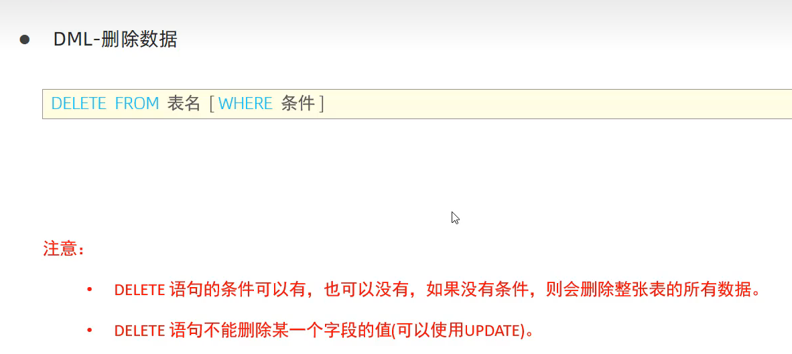

## DQL

查询表中的数据


基本查询

```mysql
select 字段1,字段2,... from 表名;  - 返回表中这几个字段的所有数据项
select * from 表名; - 返回表中所有字段的所有数据项 (不建议使用，建议把所有字段写出来)

select 字段1 [[as] 别名],字段2 [[as] 别名],... from 表名; - 给字段设置别名

select distinct 字段列表 from 表名; - 去除重复数据项
```


条件查询

```mysql
select 字段列表 from 表名 where 条件
```


聚合函数

聚合函数配合分组查询使用，聚合函数：将某一列的所有数据进行计算（null值不参与计算）


```mysql
select 聚合函数(某一字段) from 表名;
```

```mysql
select count(*) from tlias; -返回tlias表中数据项的总和
```


分组查询

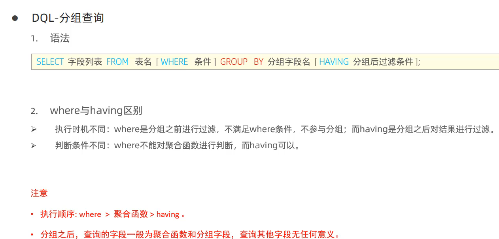

意思就是说，先根据where进行第一次的数据筛选，然后根据group by后面的字段分组，比如性别字段有两类值，第一次筛选出的数据的每一个值根据聚合函数归到不同的组去。然后对筛选出来的数据进行第二次having过滤。

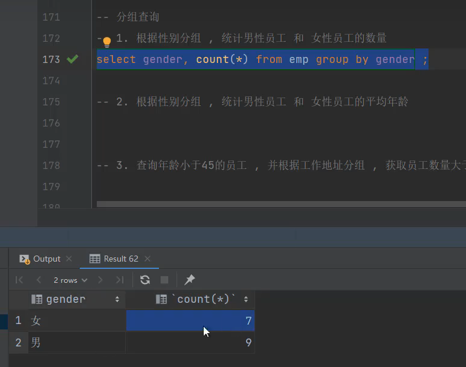


排序查询

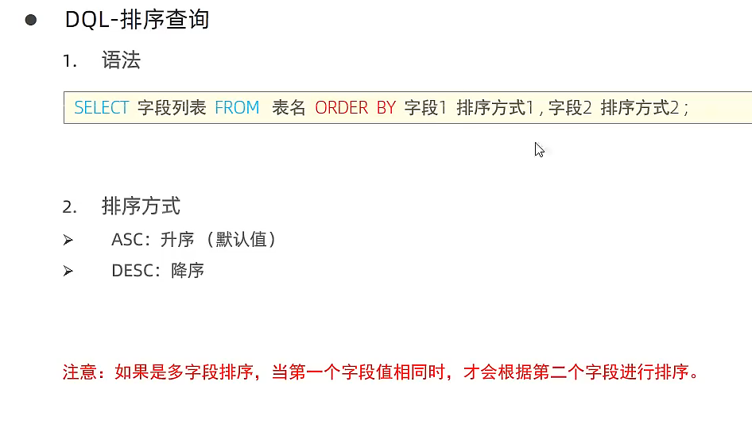

分页查询

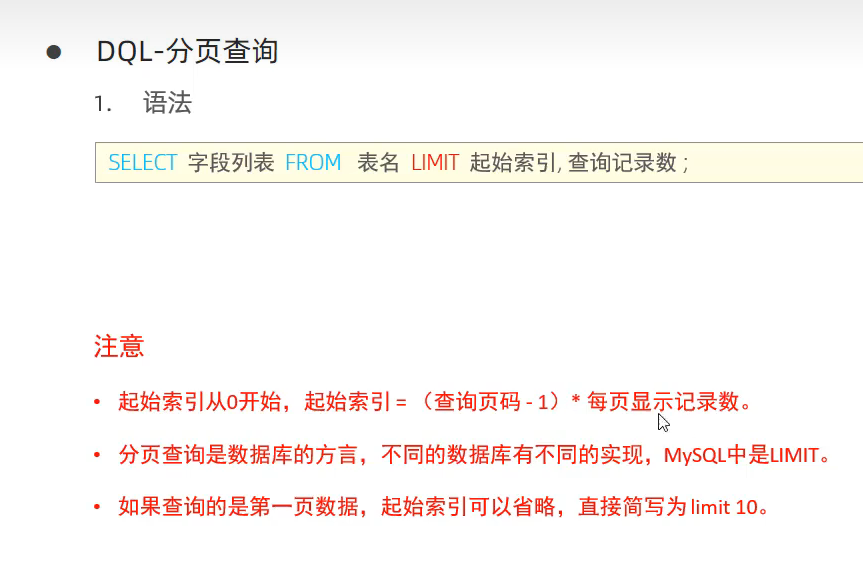

DQL执行顺序


左边是编写顺序，右边是执行顺序：

先from表名，根据表和where条件返回数据，然后再根据group by和having进行第二次筛选，然后select返回数据，再根据order by 和limit进行排序和分页。

## DCL

用来1.管理数据库的用户，2.控制数据库的访问权限的。


## 函数


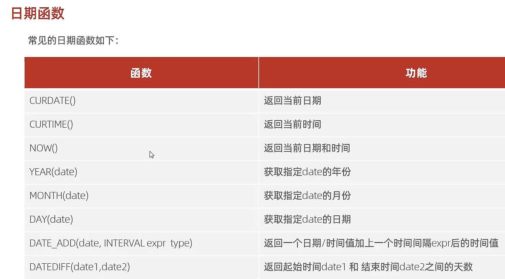


[30. 基础-函数-流程函数_哔哩哔哩_bilibili](https://www.bilibili.com/video/BV1Kr4y1i7ru?p=30&vd_source=5a374f315281b0338a0b7fd69b8b8e98)

## 约束


例子


外键约束

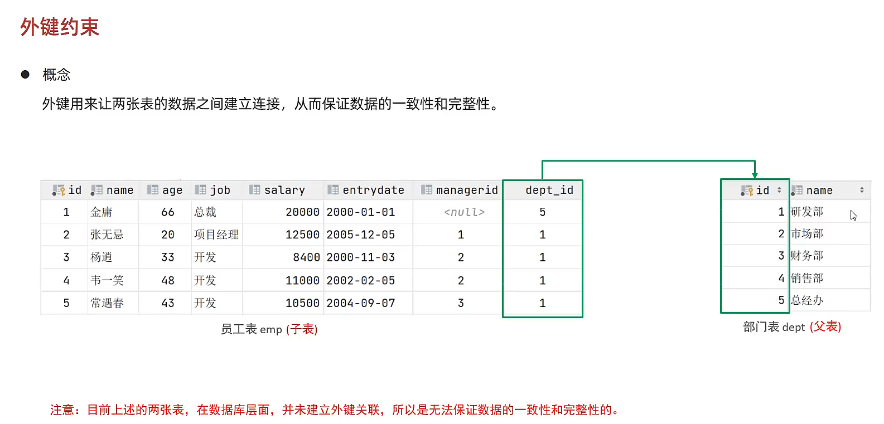

比如，父表中删除1号研发部，子表中并不会跟着删除。外键约束的作用是使两张表建立联系。子表的外键字段与父表中的主键字段相关联。


添加外键约束的两种方式，一种是建表的时候，另一种使用alter

外键名和外键字段名不是一个东西。


删除外键不会删除绑定的字段


## 多表查询

### 多表关系

数据库表结构设计阶段


一对多


多对多

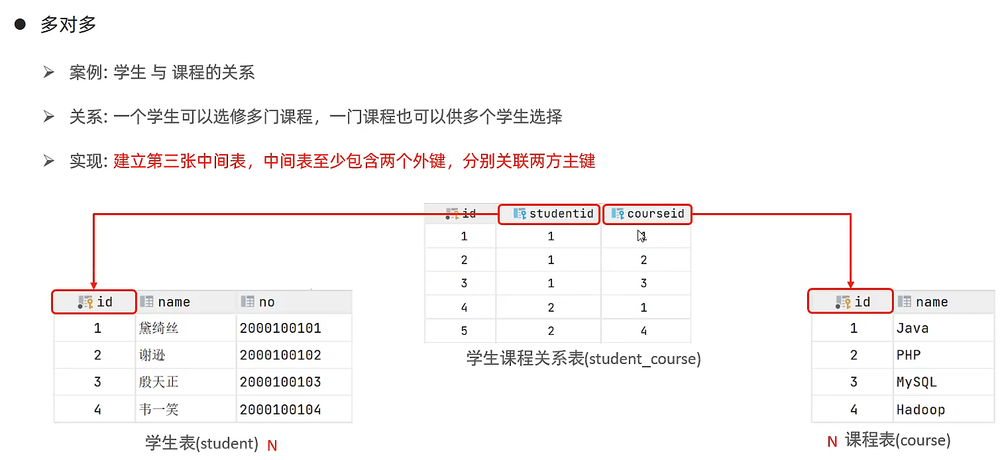

一对一


### 多表查询

```sql
select * from 表1,表2,表3  -- 查询的是这三张表的笛卡尔积
```

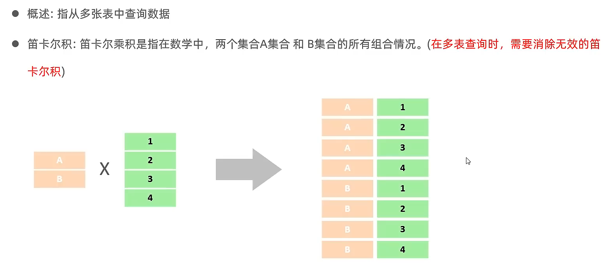

多表查询的分类


#### 内连接


例子：

在from语句执行了别名操作后，之后的语句只能使用别名而不能使用原名了。


#### 外连接

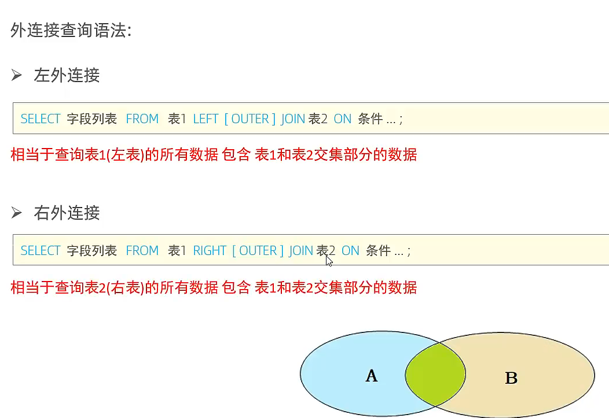

例子


#### 自连接


自连接就是查询的两张表是同一张表，此时把这一张表当成两张表看。

自连接查询可以结合内连接查询，即查询的是两张表交集的部分。交集的部分是由条件定义的。

也可以结合外连接查询，左连接和右连接是一个道理。

例子：

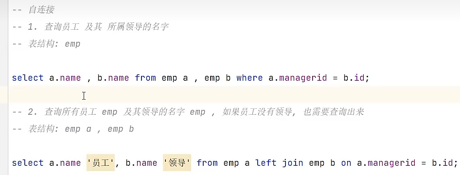

在下面这张表里，条件 where a.managerid = b.id，这个条件筛选出来这两张表交集部分。但是第一条数据不属于这个交集部分，但是在使用外连接查询的时候，会查询整张表，就会把这条数据查询出来。这个过程相当于在

`from emp a left join emp b`执行完这个就相当于先拿一张a表出来，然后根据条件，把b表的数据贴到a表数据上。


联合查询

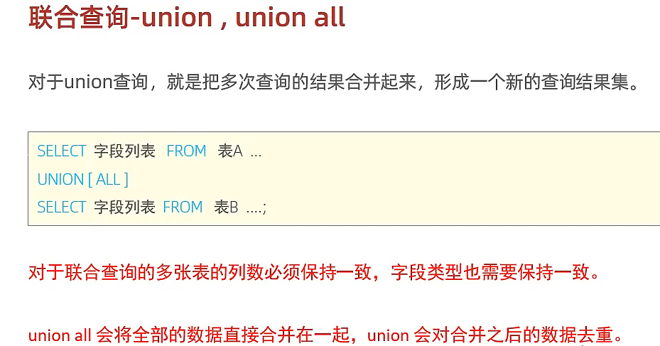

#### 子查询

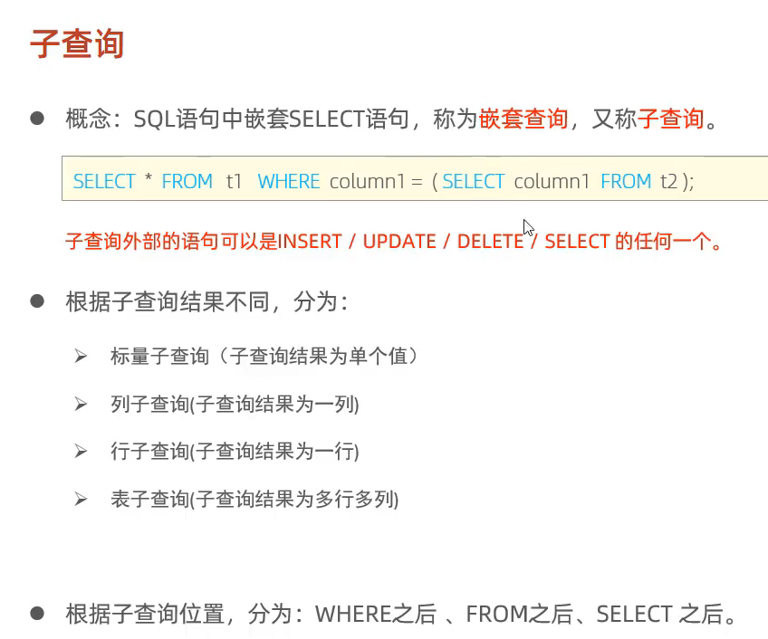

[44. 基础-多表查询-标量子查询_哔哩哔哩_bilibili](https://www.bilibili.com/video/BV1Kr4y1i7ru?p=44&vd_source=5a374f315281b0338a0b7fd69b8b8e98)


## 事务


```sql
select @@autocommit; -- 查看当前数据库是否会自动提交事务，如果值为1，则会自动提交事务。
```

自动提交事务是指：每执行一条语句，就会提交一次事务。

```sql
set @@autocommit = 0; -- 设置为手动提交
```

```sql
commit;  -- 提交事务
rollback; --回滚事务
```

```sql
start transaction;
begin;                    -- 这两个都是开启事务
```


定义事务有两种方式：

第一种，设置成手动提交。然后定义一组sql操作为一个事务，如果成功了就commit，失败了就rollback

第二种，手动开启事务，然后定义一组sql操作为一个事务，如果成功了就commit，失败了就rollback


脏读：


事务A执行update更新操作，但是还没提交。事务B执行select查询操作，读取到了事务A还没提交的update数据，发生了脏读现象。

不可重复读：


事务A读取某张表id=1的数据，然后事务B更新了id=1的数据并提交了，此时事务A又执行了select id=1的数据，读到的数据是事务B更新的数据，但是对于事务A来说，还想重复读取id=1的数据，因为事务B的影响导致事务A不可重复读了。

幻读：


事务A读取id=1的数据，没有读取到，即空表。然后事务B插入了一条id=1的数据并提交了，事务A又插入一条id=1的数据，此时发现插不进去。对于事务A来说，我明明已经看了id=1没有数据啊，为什么插不进去呢？再select id=1的数据还是没看到数据啊。


# 进阶

## 索引


