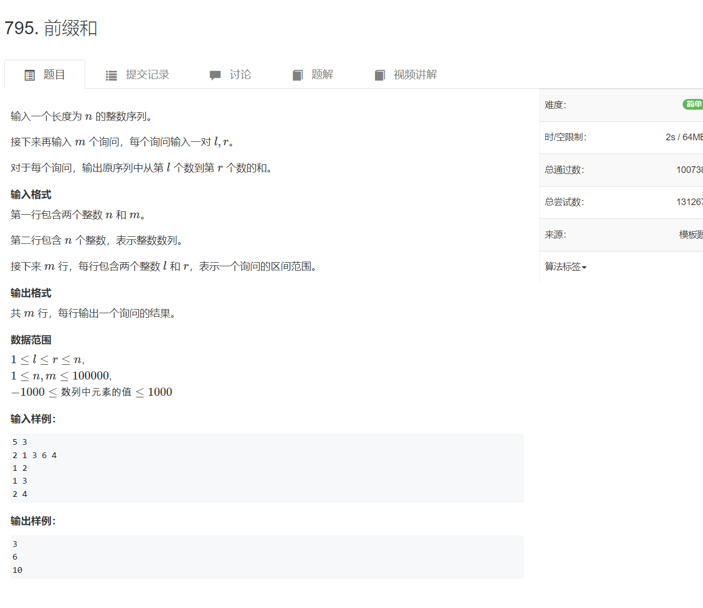

前缀和

前缀和思想：构造前缀和数组

[795. 前缀和 - AcWing题库](https://www.acwing.com/problem/content/description/797/)



```cpp
#include <iostream>
#include <cstdio>

using namespace std;

const int N = 100010;
int a[N],s[N];
int n,m;

int main()
{
    cin >> n >> m;
    for(int i = 1; i <= n;i++)
    {
        cin >> a[i];
        s[i] = s[i-1]+a[i];
    }
    while(m--)
    {
        int l,r;
        cin >> l >> r;
        cout << s[r]-s[l-1] << endl;
    }
}
```


构造前缀和数组

```cpp
const int N = 100010;
int a[N],s[N];

int main()
{
    int n;
    cin >> n;
    for(int i = 1;i <= n;i++) s[i] = s[i-1]+a[i]; //注意数组a和s都一定是从i=1开始，能省很多麻烦
}
```


[剑指 Offer 66. 构建乘积数组 - 力扣（Leetcode）](https://leetcode.cn/problems/gou-jian-cheng-ji-shu-zu-lcof/?favorite=xb9nqhhg)

利用了灵活的前缀和思想

这道题刚开始的思想：

先计算给定数组所有元素的乘积，然后对数组中的每个元素 xx*x*，将总的乘积除以 xx*x* 来求得除自身值的以外数组的乘积。

障碍有两个：

1. 程序不允许使用除法
2. 数组中可能有0


灵活的思路：

构造左缀乘合右缀乘数组完成此题。666


