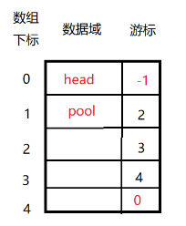
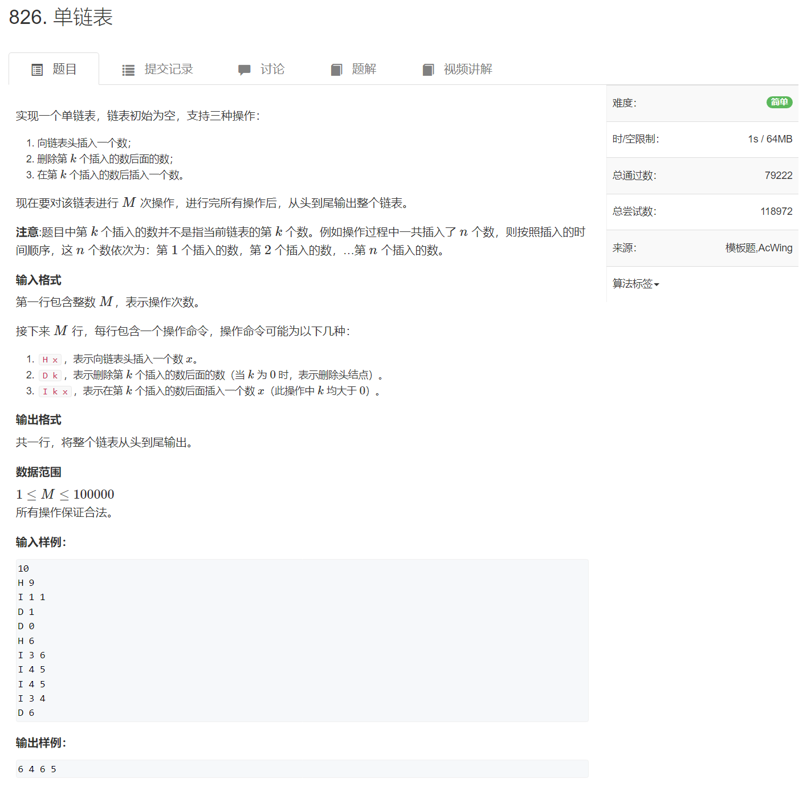

## 线性表的四种实现方式

[什么是单链表，链式存储结构详解 (biancheng.net)](http://c.biancheng.net/view/3336.html)

从逻辑结构的角度分析，线性表是一个线性结构，其开始节点和终端节点具有唯一性，除了开始开始节点和终端节点，其他的元素有且仅有一个前驱节点和后继节点。


从存储结构的角度分析：

1. 顺序存储结构

把逻辑上相邻的数据存储在物理位置上相邻的存储单位里，用物理位置上的相邻来体现逻辑上的相邻。因此线性表的顺序存储结构的具体实现可以用数组。

### 静态数组

### 动态数组

2. 链式存储结构

数据元素存放在任意的存储单元里，用指针来体现逻辑上的相邻。我们把线性表的链式存储结构叫做链表。

以下是链表的具体实现： 


### 动态链表

结构体+指针  的实现方式

首先需要自定义一个数据类型，

```cpp
typedef struct
{
    elemType elem;
    struct Node *next;
}Node;
```

elem表示结点存放的数据，`elemType elem` 是一个泛写，表示结点存放的数据可以不止一种，称为数据域。

`struct Node *next` 表示指向下一个结点的指针，用于描述线性表一一对应的逻辑，称为指针域。(有一个指针，可以构成单链表和循环链表，有两个指针，可以构成循环链表，不能再多指针了，因为线性表要满足一一对应的逻辑关系)

> 知识补充：需要对typedef，结构体有所了解。


头结点、头指针和首元节点

头指针：一个普通的指针，它的特点是永远指向链表第一个节点的位置。很明显，头指针用于指明链表的位置，便于后期找到链表并使用表中的数据；

头节点：其实就是一个不存任何数据的空节点，通常作为链表的第一个节点。对于链表来说，头节点不是必须的，它的作用只是为了方便解决某些实际问题；(构造头结点对某些问题来说是非常必要的，稍后再谈)

首元节点：链表中第一个存有数据节点。


除了结构体+指针的实现方式外，

### 静态链表

#### 两个数组实现

我们还可以维护两个数组，val和ne

```cpp
vector<int> val;  //存放链表从头到尾的结点的值val
vector<int> ne;   //存放每一个结点的指针
```





[826. 单链表 - AcWing题库](https://www.acwing.com/problem/content/828/)



```cpp
#include <iostream>

using namespace std;

const int N = 100010;


// head 表示头结点的下标
// e[i] 表示节点i的值
// ne[i] 表示节点i的next指针是多少
// idx 存储当前已经用到了哪个点
int head, e[N], ne[N], idx;

// 初始化
void init()
{
    head = -1;
    idx = 0;
}

// 将x插到头结点
void add_to_head(int x)
{
    e[idx] = x, ne[idx] = head, head = idx ++ ;
}

// 将x插到下标是k的点后面
void add(int k, int x)
{
    e[idx] = x, ne[idx] = ne[k], ne[k] = idx ++ ;
}

// 将下标是k的点后面的点删掉
void remove(int k)
{
    ne[k] = ne[ne[k]];
}

int main()
{
    int m;
    cin >> m;

    init();

    while (m -- )
    {
        int k, x;
        char op;

        cin >> op;
        if (op == 'H')
        {
            cin >> x;
            add_to_head(x);
        }
        else if (op == 'D')
        {
            cin >> k;
            if (!k) head = ne[head];
            else remove(k - 1);
        }
        else
        {
            cin >> k >> x;
            add(k - 1, x);
        }
    }

    for (int i = head; i != -1; i = ne[i]) cout << e[i] << ' ';
    cout << endl;

    return 0;
}

作者：yxc
链接：https://www.acwing.com/activity/content/code/content/42977/
来源：AcWing
著作权归作者所有。商业转载请联系作者获得授权，非商业转载请注明出处。
```

这种存储方式的特点是涉及到了插入顺序。


这个题用指针加链表的方式不好写。我已经试过了。另外指针+链表的方式会涉及到new，会很耗时间。而使用静态数组模拟不会


#### 结构体数组实现

```cpp
struct Node    //单个元素结点的定义
{
    int val;
    int next;
};
```


对线性表的一些操作


## 对数组的一些操作

### 创建数组

先看数据元素是什么类型的，需不需要自定义结构体类型

1. 创建动态数组
2. 创建静态数组

### 取值

根据位置序号$i$，获取第$i$个位置的元素值。直接用 下标运算符 $[ ]$ 就可以了

查找

根据元素值找位置。for循环遍历一遍就可以了

查找算法的运行时间的评估准则：平均查找长度(Average Search Length,ASL)

一个查找算法的ASL越大，说明时间性能差，反之，时间性能好

平均查找长度的定义：**在查找运算中，由于所费时间在关键字的比较上，所以把 需要和待查找值比较的关键字次数的平均值 称为平均查找长度。**
$$
ASL=\sum_{i=1}^{n}p_ic_i
$$
在公式中，n表示在这n个数里面查找，$p_i$为查找第i个元素的概率，通常假设每个元素查找概率相同，$p_i=\frac{1}{n}$，$c_i$是找到第$i$个元素时已经比较的次数。

在for循环数组中，我们是按照顺序遍历查找的，如果我们在第$x（x \leq n）$个元素时找到了待查找值，那么$ASL_{成功}$的值是多少呢？


所以该查找算法的时间复杂度是$O(n)$

这个东西我现在还是不理解，放着吧。

#### 插入

在某个位置插入某个元素，需要把插入位置及其后面的元素都后移一个位置，然后插进去。这个比较复杂。

### 删除

在某个位置删除某个元素，用后面的元素一一覆盖前面的元素，也比较复杂。

## 对单链表的一些操作

### 创建单链表

先创建一个结点指针，作为头指针；如果你不需要头结点，那么创建一个头指针就ok了，等着new首元结点，然后把头结点指向首元结点就可以了。如果你需要头结点，那么在创建头结点之后，new一个结点，不管数据域，指针指向NULL，然后把头指针指向头结点就可以了，之后就等着new首元节点，然后让头结点的指针指向首元节点

创建单链表可以分为前插法和后插法。挺简单的，不写了。

### 取值

根据位置序号$i$，获取第$i$个位置的元素值。这个比数组取值麻烦，要for循环和计数器。

### 查找

根据元素值找位置。这个跟数组一样，都是顺序查找。

### 插入

这个比数组简单，直接new一个结点之后，改一改指针就可以了

#### 删除


比插入还简单，只要执行 `p->next = p->next->next` 就ok了


## 两种特殊结构的链表

### 循环链表

相较于单链表而言，唯一的区别就是没有把最后一个结点的指针置NULL,而是让它指向了头结点或首元结点。遍历的时候把循环结束的条件由 `p->next != NULL`或 `p!= NULL`改成了 `p->next != L`或 `p != L` （L是头指针）

### 双向链表

跟单链表比，多了一个指针，多出来的这个指针指向它前面的一个元素。

```cpp
typedef struct line{
    struct line * prior; //指向直接前趋
    elemType data;
    struct line * next; //指向直接后继
}line;
```


先创建一个头指针，如果不需要头结点，等着new结点就行了；如果需要头结点，就new一个头结点，不管数据域，两个指针置为NULL，等着new结点就行了。


静态双向链表

```cpp
int e[],l[],r[];
//e[i]表示第i个插入的节点的值
//l[i]表示第i个插入的结点的左指针
//l[i]表示第i个插入的结点的右指针

```

[827. 双链表 - AcWing题库](https://www.acwing.com/problem/content/829/)


```cpp
void init()  //初始化
{
    // 选择两个结点作为 链表的边界（头结点），这两个结点不记录数值信息
    // 下标为 0 的结点表示链表的左端点，下表为 1 的结点表示链表的右端点
    r[0] = 1; // 0 号点的右边是 1 号点
    l[1] = 0; // 1 号点的左边是 0 号点
    // 这两个头结点的引入，能让第一个数据结点的操作与普通的结点相同，简化操作。

    idx = 2; // 下标为 0 和 1 的结点被占用了 
} 
```


```cpp
// 在下标为 k 的结点的右边插入结点 x
void add( int k, int x )
{
    e[idx] = x;
    r[idx] = r[k];
    l[idx] = k;

    l[r[k]] = idx; 
    r[k] = idx;     

    idx++;
}
```


