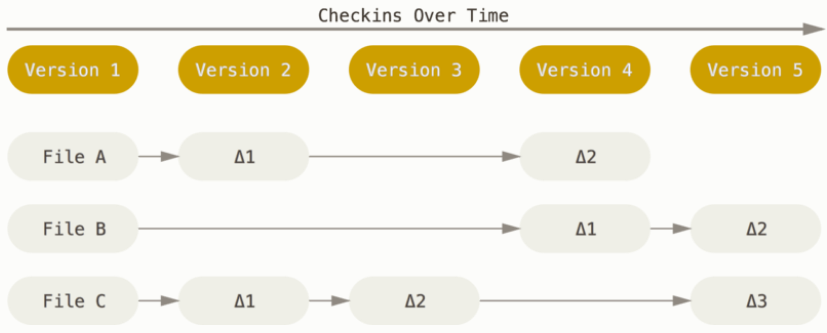
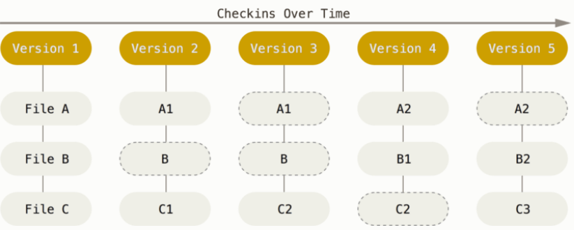
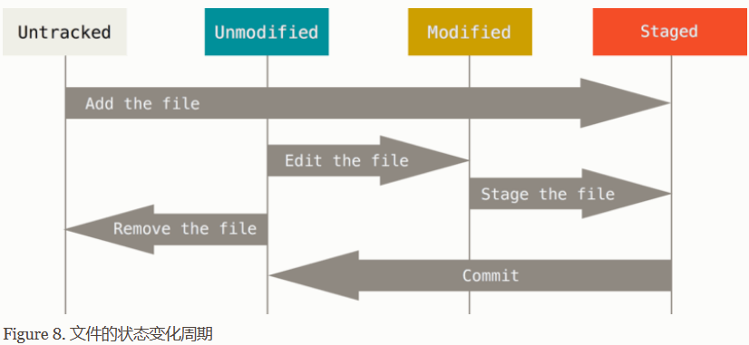
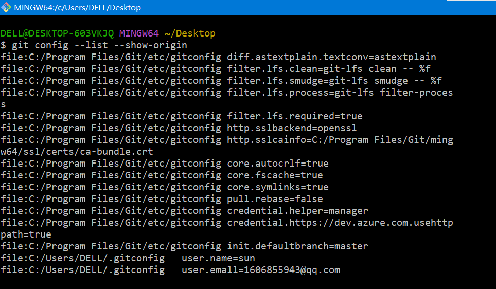

# VCS  --  version control system

版本控制是用来记录一个或若干文件内容的变化，以便将来查阅特定版本修订情况。

一般来说，我们对保存着软件源代码的文件作版本控制，但实际上，你可以对任何类型的文件进行版本控制。

有了VCS你就可以将选定的文件回溯到之前的状态，甚至将整个项目都回退到过去某个时间点的状态，你可以比较文件的变化细节，查出最后是谁修改了哪个地方，从而找出导致怪异问题出现的原因，又是谁在何时报告了某个功能缺陷等等。 使用版本控制系统通常还意味着，就算你乱来一气把整个项目中的文件改的改删的删，你也照样可以轻松恢复到原先的样子。


第一代版本控制---**本地版本控制系统**

许多人习惯用复制整个项目目录的方式来保存不同的版本，或许还会改名加上备份时间以示区别。 这么做唯一的好处就是简单，但是特别容易犯错。 有时候会混淆所在的工作目录，一不小心会写错文件或者覆盖意想外的文件。

为了解决这个问题，人们很久以前就开发了许多种本地版本控制系统，大多都是采用某种简单的数据库来记录文件的历次更新差异。

其中最流行的一种叫做 RCS，其工作原理是在硬盘上保存补丁集（补丁是指文件修订前后的变化），通过补丁，可以知晓各个版本的文件内容


第二代版本控制---**集中化的版本控制系统**

集中化的版本控制系统（Centralized Version Control Systems，简称 CVCS）

让在不同系统上的开发者协同工作，这类系统，诸如 CVS、Subversion 以及 Perforce 等，都有一个单一的集中管理的服务器，保存所有文件的修订版本，而协同工作的人们都通过客户端连到这台服务器，**取出最新的文件**(不会取历史版本的变更记录)或者提交更新。 多年以来，这已成为版本控制系统的标准做法。

现在，每个人都可以在一定程度上看到项目中的其他人正在做些什么。 而管理员也可以轻松掌控每个开发者的权限，并且管理一个 CVCS 要远比在各个客户端上维护本地数据库来得轻松容易。

缺点是中央服务器的单点故障。 如果宕机一小时，那么在这一小时内，谁都无法提交更新，也就无法协同工作。 如果中心数据库所在的磁盘发生损坏，又没有做恰当备份，毫无疑问你将丢失所有数据——包括项目的整个变更历史，只剩下人们在各自机器上保留的单独快照。 本地版本控制系统也存在类似问题，只要整个项目的历史记录被保存在单一位置，就有丢失所有历史更新记录的风险。

第三代版本控制---**分布式版本控制系统**

分布式版本控制系统（Distributed Version Control System，简称 DVCS）

在这类系统中，像 Git、Mercurial、Bazaar 以及 Darcs 等，

1. **客户端并不只提取最新版本的文件快照， 而是把代码仓库完整地镜像下来，包括完整的历史记录。** 这么一来，任何一处协同工作用的服务器发生故障，事后都可以用任何一个镜像出来的本地仓库恢复。 因为每一次的克隆操作，实际上都是一次对代码仓库的完整备份。

2. 更进一步，许多这类系统都可以指定和若干不同的远端代码仓库进行交互。籍此，你就可以在同一个项目中，分别和不同工作小组的人相互协作。 你可以根据需要设定不同的协作流程，比如层次模型式的工作流，而这在以前的集中式系统中是无法实现的。

根据2的理解，我觉得分布式与集中式的区别在于，集中式是将许多开发者需要代码更新到一个服务器上，这就导致这个项目只能有一种方向，而分布式是如果在项目开发的过程中如果有新的方向(分支),可以将项目clone

# git

了解完版本控制，接下来了解git

## git的优势

### git存储版本的方式

git之外的其他版本控制app存储数据是以文件变更列表的方式存储每一个版本。



比如上面这张图，版本1记录的是文件ABC，版本2记录的是文件A的第一次更新内容$\delta$1和文件C的第一次更新内容，版本3记录的是文件C的第二次更新内容，以此类推……


在 Git 中，每当你提交更新或保存项目状态时，它基本上就会对当时的全部文件创建一个快照并保存这个快照的索引。 为了效率，如果文件没有修改，Git 不再重新存储该文件，而是只保留一个链接指向之前存储的文件。 



git保存版本的方式如图，每个版本都会创建一个快照。

git这种方式有什么优点稍后再谈……

### 近乎所有操作都是本地执行

Git中的绝大多数操作都只需要访问本地文件和资源，一般不需要来自网络上其它计算机的信息。而集中式版本控制系统的所有操作都存在网络延时。<!--速度炒鸡快-->

举个例子，要浏览项目的历史，Git 不需外连到服务器去获取历史，然后再显示出来——它只需直接从本地数据库中读取。 你能立即看到项目历史。如果你想查看当前版本与一个月前的版本之间引入的修改， Git 会查找到一个月前的文件做一次本地的差异计算，而不是由远程服务器处理或从远程服务器拉回旧版本文件再来本地处理。

这也意味着你在离线或者没有 VPN 时，几乎可以进行任何操作。 如你在飞机或火车上想做些工作，就能愉快地提交到你的**本地**副本， 直到有网络连接时再上传至服务器。如你回家后 VPN 客户端不正常，那么也仍能工作。

但是如果使用其它系统的话，做到这些是不可能或很费力的。 比如，用 Perforce 的话，没有连接服务器时几乎不能做什么事；而用 Subversion 和 CVS 的话， 你能修改文件，但不能向数据库提交修改（因为你的本地数据库离线了）。 这样似乎问题不大，但是你可能会惊喜地发现它带来的巨大的不同，即git更方便。

### Git 保证完整性

Git 中所有的数据在存储前都计算校验和，然后以校验和来引用。 **这意味着不可能在 Git 不知情时更改任何文件内容或目录内容。** 这个功能建构在 Git 底层，是构成 Git 哲学不可或缺的部分。 **若你在传送过程中丢失信息或损坏文件，Git 就能发现。**

### Git 一般只添加数据

你执行的 Git 操作，几乎只往 Git 数据库中 **添加** 数据。 你很难使用 Git 从数据库中删除数据，也就是说 Git 几乎不会执行任何可能导致文件不可恢复的操作。 同别的 VCS 一样，未提交更新时有可能丢失或弄乱修改的内容。但是一旦你提交快照到 Git 中， 就难以再丢失数据，特别是如果你定期的推送数据库到其它仓库的话。

这使得我们使用 Git 成为一个安心愉悦的过程，因为我们深知可以尽情做各种尝试，而没有把事情弄糟的危险。 更深度探讨 Git 如何保存数据及恢复丢失数据的话题，请参考[撤消操作](https://www.git-scm.com/book/zh/v2/ch00/_undoing)。

不是很理解，挖个坑先。

### git 分布式版本管理


## git的相关概念

### 文件的四种状态

文件有三种状态：**已提交（committed）**、**已修改（modified）** 、**已暂存（staged）**和**未跟踪(untracked)**

- 已修改表示修改了文件，但还没保存到数据库中。
- 已暂存表示对一个已修改文件的当前版本做了标记，使之包含在下次提交的快照中。
- 已提交表示提交快照，即数据已经安全地保存在本地数据库中。
- 未追踪表示文件还不是项目的一部分

### git项目的四个阶段

文件的四种状态这会让我们的 Git 项目拥有四个阶段：工作区、暂存区以及 Git 仓库。

工作区是提取出来的 项目某个版本的内容。 这些从 Git 仓库的压缩数据库中提取出来的文件，放在磁盘上供你使用或修改。 

==工作区在git项目的目录下==

暂存区是一个文件，保存了下次将要提交的文件列表信息，一般在 Git 仓库目录中，==这里的Git仓库是指这个项目的本地仓库，这个本地仓库就是 `.git文件`,即暂存区在 `.git文件` 里==。

Git 仓库目录是 Git 用来保存项目的元数据和对象数据库的地方。



可以看出git的工作流程

如果是未跟踪文件，先将文件放到暂存区；如果是未修改文件可以更新之后，将文件放到暂存区；然后将暂存区的文件提交到本地仓库。

## 安装git

有几个选项需要看一下

additional icons

​	On the Desktop     //我不需要

Windows Explorer integration  --- 鼠标右键菜单

​	只勾选Bash

Git LFS(Large File Support)    //大文件支持，不知道是干什么的，这个需要勾选，以后再看吧

Associate .git* configuration files with the default text edition   //指用默认文本编辑器打开git的配置文件，勾选

`.git* configuration files    中这个 .git*是什么意思？` 

*是通配符，匹配任意长度的任意字符串

Associate .sh files to be run with Bash  //将.sh文件关联到Bash运行，`不知道啥意思，另外.sh文件是干啥的。`这个也要勾选

每天检查更新不勾选

**Add a Git Bash Profile to Windows Terminal:将Git Bash的配置文件添加在Windows终端中的配置文件中（这是2.34.1版本新增的功能，省去了自己额外单独添加）**

这个也不知道是干啥的，勾选

Scalar (Git add-on to manage large-scale repositories)     Git管理大型仓库的附加组件Scalar(人话:是否安装管理大型仓库工具Scalar),  勾选

add-on 附加组件

Scalar 介绍(挖坑，具体怎么用不知道，以后再了解)

Scalar 是一个使用 C# 编写的 .NET Core 应用程序（后来使用 C 进行了重写），其通过设置所建议的配置值和运行后台维护来最大程度优化 Git 命令的性能。无论开发者使用什么服务来托管代码仓库，Scalar 都能有效地加速 Git 指令。微软提到，**只要使用 Scalar 为体积最大的代码仓库进行注册，就能马上感受到 Git 执行速度大的幅提升。**

Git 一直在积极优化对巨型仓库的处理，最新引入的 Scalar 提供了一套精心设计和配置的功能，目的是为优化巨型 Git 仓库处理而进行预配置。Scalar 默认启用内置文件系统监视器、多软件包索引、commit 图、在后台进行调度的 maintenance、部分克隆和稀疏检出等功能。

Scalar 是由微软主导开发的项目，其开源之初就表示要贡献给 Git，以更好地处理巨型 Git 仓库，现在终于成为 Git 2.38 主线的一部分。


文本编辑器(text editor)就选用vim就好了，毕竟学linux的时候也会学vim


## 初次配置

安装完之后需要对git进行配置

Git使用`git config`命令来控制  控制Git的外观和行为   的配置变量，这些用于配置的变量存放在以下配置文件中：

1. `Git/etc/gitconfig` 文件: 包含系统上每一个用户及他们仓库的通用配置。 如果在执行 `git config` 时带上 `--system` 选项，那么它就会读写该文件中的配置变量。 （由于它是系统配置文件，因此你需要管理员或超级用户权限来修改它。）

如果不知道git的安装目录，可以打开git bash  ，输入命令  where git 就可以了

1. `C:\Users\DELL\.gitconfig` 或 `~/.config/git/config` 文件：只针对当前用户。 你可以传递 `--global` 选项让 Git 读写此文件，这会对你系统上 **所有** 的仓库生效。
2. 当前使用仓库的 Git 目录中的 `config` 文件（即 `.git/config`）：针对该仓库。 你可以传递 `--local` 选项，也可以不传递，让 Git 强制读写此文件，虽然默认情况下用的就是它。。 （当然，你需要进入某个 Git 仓库中才能让该选项生效。）

总结：

git config 命令有四种情况：不带参数，带--local参数，带--global参数，带--system参数，如下所示：

```shell
git config

git config --local

git config --global   //读出第二个文件的内容

git config --system  //读出第一个文件的内容
```

**备注：git config 不带参数的情况，等同于：带--local参数**

本地电脑上的git系统可以有多个用户，每个用户又可以有多个仓库，system选项读出的是git整个系统的配置文件，这个是交给管理git的管理员使用的，我们作为用户不用知道这个怎么用

最常用的是global选项读出的文件，这个文件是我们用户配置自己名下的仓库的配置文件。

你可以通过以下命令查看所有的配置以及它们所在的文件：

```console
$ git config --list --show-origin
```

如果想要检查你的配置，可以使用 `git config --list` 命令来列出所有 Git 当时能找到的配置。

给我自己注册个账户

```
$ git config --global user.name "sun"
$ git config --global user.email 1606855943@qq.com
```

在桌面目录下我右键git bash，我是用的global参数，让我这台电脑上所有的仓库都在这个账户下。如果不使用global参数的话，也是可以创建账户的，不过git会将该桌面目录作为一个仓库，且把这个仓库作为我新建账户下的仓库，而不是该系统所有的仓库




## 命令手册

若你使用 Git 时需要获取帮助，有三种等价的方法可以找到 Git 命令的综合手册（manpage）：

```console
$ git help <verb>
$ git <verb> --help
$ man git-<verb>
```

例如，要想获得 `git config` 命令的手册，执行

```console
$ git help config
```


## 如何使用

### 获取 Git 仓库

通常有两种获取 Git 项目仓库的方式：

1. 将尚未进行版本控制的本地目录转换为 Git 仓库；
2. 从其它服务器 **克隆** 一个已存在的 Git 仓库。

两种方式都会在你的本地机器上得到一个工作就绪的 Git 仓库。

##### 在已存在目录中初始化仓库

1. 首先需要进入该项目目录中(要么用cd命令，要么直接在该目录下打开git bash)
2. 执行该命令

```
$ git init
```

该命令将创建一个名为 `.git` 的子目录(默认是隐藏的文件夹)，这个子目录含有你初始化的 Git 仓库中所有的必须文件，这些文件是 Git 仓库的骨干。如果你把 `.git文件`给删了，那么这个目录就不是git仓库了。  

这样这个项目目录就是你的git仓库了。

3. 对该目录下的文件进行跟踪

将工作目录下需要纳入版本的文件进行跟踪，然后进行初始提交。

可以通过 `git add` 命令：

git add 文件名   

1. 将未跟踪文件修改为已跟踪文件，并放入暂存区

2. 将已跟踪文件放入暂存区

`git add .` 是把该目录下所有文件放到本地仓库的暂存区

然后执行 `git commit` ：

```console
$ git add *.c
$ git add LICENSE
$ git commit -m 'initial project version'
```

 现在，你已经得到了一个存在被追踪文件与初始提交的 Git 仓库。

#### 克隆现有的仓库

克隆仓库的命令是 `git clone <url>` 。 比如，要克隆 Git 的链接库 `libgit2`，可以用下面的命令：

```console
$ git clone https://github.com/libgit2/libgit2
```

这会**在当前目录下创建一个名为 “libgit2” 的目录(git仓库)**，并在这个仓库里初始化一个 `.git` 文件夹， 从远程仓库拉取下**所有数据放入 `.git` 文件夹**，然后从中读取最新版本的文件的拷贝。 如果你进入到这个新建的 `libgit2` 文件夹，你会发现所有的项目文件已经在里面了，准备就绪等待后续的开发和使用。初次克隆某个仓库的时候，工作目录中的所有文件都属于已跟踪文件，并处于未修改状态，因为 Git 刚刚检出了它们， 而你尚未编辑过它们。

如果你想在克隆远程仓库的时候，自定义本地仓库的名字，你可以通过额外的参数指定新的目录名：

```console
$ git clone https://github.com/libgit2/libgit2 mylibgit
```

这会执行与上一条命令相同的操作，但目标目录名变为了 `mylibgit`。

Git 支持多种数据传输协议。 上面的例子使用的是 `https://` 协议，不过你也可以使用 `git://` 协议或者使用 SSH 传输协议，比如 `user@server:path/to/repo.git` 。

### 记录每次更新到仓库

现在我们的机器上有了一个 **真实项目** 的 Git 仓库，并从这个仓库中检出了所有文件的 **工作副本**。 通常，你会对这些文件做些修改，每当完成了一个阶段的目标，想要将记录下它时，就将它提交到仓库。


获得git仓库流程：

```
git init
新建文件
git add .   //把所有文件放到暂存区
git status   //查看所有文件的状态，看看自己add成功没
git commit -m "注释内容"   //提交本次版本到本地仓库，并注释更新的内容
```

```
git clone <url> [仓库目录名]  //没有说明仓库目录名的话，就是源仓库的名字
```

git status  //查看项目目录下除 `.git文件`外 所有文件的状态，经常要用

git仓库使用流程：

```
更新工作区的文件
git add .
git status
git commit -m "注释内容"   
```


以上都是更新到本地仓库。

> 忽略文件


> 代码托管平台

代码托管平台，就是托管代码的服务器。可以将自己的项目放到代码托管平台上，也可以在该平台上下载其他人的项目，也可用于多人协作，将代码更新到平台上的项目上，来开发项目，也可以防止因为自己机器的原因导致整个项目丢失，即远程仓库。

github

gitee

gitlab  --搭建代码托管平台用的


### 本地仓库和github仓库关联

[【git】- 将本地项目关联到github远程仓库 - 知乎 (zhihu.com)](https://zhuanlan.zhihu.com/p/88246764)

C:\Users\DELL\.ssh

在该目录下，打开git bash

输入命令  ssh-keygen -t -rsa 

这条命令是生成ssh密钥，生成的两个文件中.pub后缀的是公钥，另一个是密钥，不能公开。

