作者：知乎用户

链接：https://www.zhihu.com/question/58339949/answer/2305409944

来源：知乎

著作权归作者所有。商业转载请联系作者获得授权，非商业转载请注明出处。

## 机器学习、神经网络和深度学习

首先，有必要对机器学习、神经网络、深度学习的概念做个简单描述。

机器学习是一门多领域[交叉学科](https://www.zhihu.com/search?q=交叉学科&search_source=Entity&hybrid_search_source=Entity&hybrid_search_extra={"sourceType"%3A"answer"%2C"sourceId"%3A584024106})，涉及概率论、统计学、[逼近论](https://link.zhihu.com/?target=https%3A//baike.baidu.com/item/%E9%80%BC%E8%BF%91%E8%AE%BA/967006)、[凸分析](https://link.zhihu.com/?target=https%3A//baike.baidu.com/item/%E5%87%B8%E5%88%86%E6%9E%90)、[算法复杂度](https://link.zhihu.com/?target=https%3A//baike.baidu.com/item/%E7%AE%97%E6%B3%95%E5%A4%8D%E6%9D%82%E5%BA%A6)理论等多门学科。专门研究计算机怎样模拟或实现人类的学习行为，以获取新的知识或技能，重新组织已有的知识结构使之不断改善自身的性能。

机器学习囊括很多机器学习算法，比如线性回归、支持向量机(SVM)、最近邻居(KNN)、逻辑回归、决策树、k平均、随机森林、朴素贝叶斯，**神经网络也是一种机器学习算法**。

[【机器学习基础】机器学习模型与算法最全分类汇总！_风度78的博客-CSDN博客](https://blog.csdn.net/fengdu78/article/details/115878843)

**什么是线性模型，线性回归、逻辑回归、softmax回归、感知机都是线性模型，而神经网络有要求有激活函数，激活函数是**

神经网络，灵感来自动物的中枢神经系统，大脑为什么能够思考？原因在于人体的神经网络，而神经网络的基本组成就是神经元：

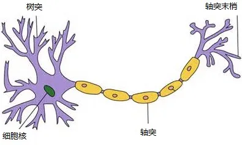

1、外部刺激通过神经元的神经末梢，转化为电信号，传导到神经元。

2、神经元的树突接收电信号，由神经元处理是否达到激活阈值再输出兴奋或者抑制电信号，最后由轴突将信号传递给其它细胞。

3、无数神经元构成神经中枢。神经中枢综合各种信号，做出判断。

4、 人体根据神经中枢的指令，对外部刺激做出反应。

科学家以此为原理发明了人工神经元数学模型，并以神经元为基础而组合成人工神经网络模型。

如上图就是人工神经元的基本结构。它可以输入一定维数的输入（如：3维的输入，x1，x2, x3），每个输入都相要乘上相应的权重值（如：w0,w1,w2），乘上每一权重值的作用可以视为对每一输入的加权，也就是对每一输入的神经元对它的重视程度是不一样的。

接下来神经元将乘上权重的每个输入做下求和（也就是[加权求和](https://www.zhihu.com/search?q=加权求和&search_source=Entity&hybrid_search_source=Entity&hybrid_search_extra={"sourceType"%3A"answer"%2C"sourceId"%3A2186812239})），并加上截距项（截距项b可以视为对神经元阈值的直接调整），最后由[激活函数](https://www.zhihu.com/search?q=激活函数&search_source=Entity&hybrid_search_source=Entity&hybrid_search_extra={"sourceType"%3A"answer"%2C"sourceId"%3A2186812239})（f）非线性转换为最终输出值。

激活函数的种类很多，有[sigmoid](https://www.zhihu.com/search?q=sigmoid&search_source=Entity&hybrid_search_source=Entity&hybrid_search_extra={"sourceType"%3A"answer"%2C"sourceId"%3A2186812239})，tanh，sign，relu，softmax等等（下一专题会讨论下激活函数）。激活函数的作用是在神经元上实现一道非线性的运算，以通用万能近似定理——“如果一个[前馈神经网络](https://www.zhihu.com/search?q=前馈神经网络&search_source=Entity&hybrid_search_source=Entity&hybrid_search_extra={"sourceType"%3A"answer"%2C"sourceId"%3A2186812239})具有线性输出层和至少一层隐藏层，只要给予网络足够数量的神经元，便可以实现以足够高精度来逼近任意一个在 ℝn 的[紧子集](https://www.zhihu.com/search?q=紧子集&search_source=Entity&hybrid_search_source=Entity&hybrid_search_extra={"sourceType"%3A"answer"%2C"sourceId"%3A2186812239}) (Compact subset) 上的连续函数”所表明，激活函数是[深度神经网络](https://www.zhihu.com/search?q=深度神经网络&search_source=Entity&hybrid_search_source=Entity&hybrid_search_extra={"sourceType"%3A"answer"%2C"sourceId"%3A2186812239})学习拟合任意函数的前提。

激活函数是神经网络非常重要的部分，为什么这么说呢？激活函数的作用是为神经元实现一道非线性运算，如果没有激活函数，那么无论多复杂的神经网络都只是线性模型，**多个线性函数的组合仍为线性函数**，没有激活函数的神经网络就不是神经网络了，只是线性模型。线性模型太差劲了。

通用近似定理？？👇？？

**神经网络的本质就是通过参数与激活函数来拟合特征与目标之间的真实函数关系。**拟合两个字的含义是指我们并不知道特征与目标的真实函数关系，我们用参数+激活函数的方式用训练数据训练我们的模型，使之能拟合出它们的真实函数关系。

其实线性模型也是一样的，只不过线性模型只能拟合线性关系，但大多数情况下，特征与目标之间不会是线性关系，更可能是复杂的非线性关系。

多层感知机可以通过隐藏神经元，捕捉到输入之间复杂的相互作用， 这些神经元依赖于每个输入的值。 我们可以很容易地设计隐藏节点来执行任意计算。 例如，在一对输入上进行基本逻辑操作，多层感知机是通用近似器。 即使是网络只有一个隐藏层，给定足够的神经元和正确的权重， 我们可以对任意函数建模，尽管实际中学习该函数是很困难的。

-------------------------------------------------------------------------------------------------------------------------------------------

**虽然一个单隐层网络能学习任何函数， 但并不意味着我们应该尝试使用单隐藏层网络来解决所有问题。 事实上，通过使用更深（而不是更广）的网络，我们可以更容易地逼近许多函数。**

神经网络的分类：

1. 线性神经网络

   1. 李沐提到将线性回归和softmax回归看作神经网络，是因为可以用描述神经网络的方式来描述线性回归，我们描述神经网络的方式通常是用神经网络图。个人并不认为可以将线性回归并入神经网络，因为线性回归模型没有激活函数，softmax回归有非线性函数softmax，可以将softmax看成是单层神经网络。

      以上理解是有误的，判断一个模型是不是神经网络就看这个模型能不能用神经元来模拟出来，换句话说是能不能用神经网络图表述出来。

      线性回归和softmax回归还有感知机都是线性神经网络。什么是线性神经网络呢？单层神经网络就是线性神经网络，也就是线性模型。对于隐藏层没有激活函数的多层神经网络，没有激活函数也就没有引入非线性，还是可以等价成一个单层的神经网络。

      我们思考一下，对于二层神经网络而言，中间的隐藏层加入了激活函数，将线性模型转化为非线性模型。

      而单层神经网络，只有输入层和输出层，输出层的激活函数去掉之后，还是一个线性模型，也就是我们另一章里讲到的  分类也是回归的一种。

      关于层的概念：我们想一下神经元，神经元是接受刺激，产生输出的；输入层指向输出层的箭头可以看成是刺激，把输出层的每一个元素看成一个神经元，神经元产生的输出就是神经网络的输出。所以可以把输出层看成是一层神经元，那么这就是个单层的神经网络。

      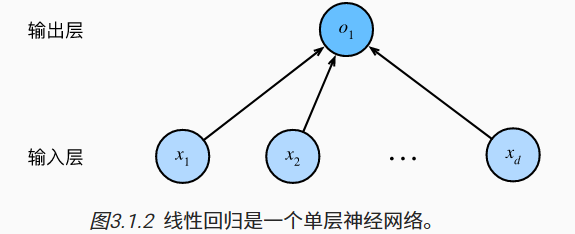

      

      关于层的理解：我们再举一个例子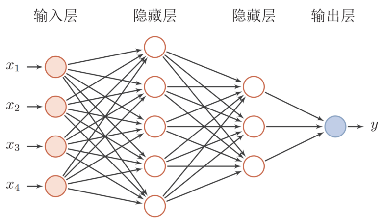

      这是一个三层的神经网络，输入层指向第一层隐藏层的箭头可以看成是刺激，把隐藏层的每一个圈看成是一个神经元，那么第一层隐藏层的最上面那个神经元，有来自$x_1,x_2,x_3,x_4$的四个箭头，就是四个刺激，这个神经元的输出又是下一层神经元的刺激，第二层隐藏层的神经元的输出又是输出层神经元的刺激，输出层神经元的输出作为这个三层神经网络的输出。

   2. 多层感知机，相较于感知机，引入了非线性，非线性模型比线性模型能拟合更多的函数，表达能力比线性模型要好，就比如，非线性模型能拟合xor函数，线性模型不能。为什么说感知机是神经网络的起源，[神经网络发展历史 - 知乎 (zhihu.com)](https://zhuanlan.zhihu.com/p/379350530)

   3. 上面这两类实际上就是两种神经网络，单层和多层神经网络，单层神经网络是线性的，多层是非线性的，更屌一点。**多层感知机(Multi-Layer perceptron,MLP)**跟**前馈神经网络(Feedforward Neutral Network,FNN)**跟**深层神经网络(Deep Netural Network,CNN)**都是指同一种东西(存疑甚至错误)，它们是同义词。[深度学习基础——前馈神经网络（FNN） - 知乎 (zhihu.com)](https://zhuanlan.zhihu.com/p/55168032)

      前馈神经网络是一种新的机器学习算法，学习一种机器学习算法就是学习机器学习算法的三个要素，模型、学习准则和优化算法，看看上面那一篇是怎么介绍的。

      [前馈神经网络_百度百科 (baidu.com)](https://baike.baidu.com/item/前馈神经网络/7580523)，前馈神经网络也有不同的种类，比如感知机和bp的区别？

   4. 前馈神经网络不涉及循环和反馈，可以看看这篇文章，了解一下其他类别的神经网络，从而更理解前馈神经网络。[神经网络主要类型及其应用 - 知乎 (zhihu.com)](https://zhuanlan.zhihu.com/p/159305118)

   5. 多层感知机是多层的全连接的前馈网络。从输入层到隐藏层到输出层，逐层计算结果，即所谓前馈？？？

   我们说，只要能够用神经元模拟出来的模型，换句话说，能用神经网络图描述出来的，就把这个模型看作神经网络。深度学习就是神经网络的一种，上面那个链接中介绍了各种各样的神经网络，纵向按层延伸的神经网络就是深度学习的内容，这也就是为什么是 “深度学习”，因为是朝着神经网络的多层次研究的。

   深度神经网络长啥吊样的都有，比如全连接和部分连接，只是前馈或者存在循环，等等都属于深度学习的内容，深度神经网络和深度学习有啥区别？是不是深度神经网络只是一种泛概念，具体的三要素咋实现交给深度学习研究，也就是说，深度学习也是一个泛概念，研究深度s

深度学习是神经网络的进阶版，它的基本思路与神经网络类似，但往往比神经网络有着更复杂的结构以及优化算法，**是神经网络的纵向延伸**，常见的模型有CNN, RNN, LSTM等。

**什么是模型的可解释性**

深度学习是一个黑箱，

黑箱的意思是，深度学习的中间过程不可知，深度学习产生的结果不可控。

一方面，我们比较难知道网络具体在做些什么；另一方面，我们很难解释神经网络在解决问题的时候，为什么要这么做，为什么有效果。

在传统的机器学习中，算法的结构大多充满了逻辑，这种结构可以被人分析，最终抽象为某种流程图或者一个代数上的公式，最典型的比如决策树，具有非常高的可解释性。

到了深度学习，这样子的直观就不见了。简单来说，深度学习的工作原理，是通过一层层神经网络，使得输入的信息在经过每一层时，都做一个数学拟合，这样每一层都提供了一个函数。因为深度学习有好多层，通过这每一层的函数的叠加，深度学习网络的输出就无限逼近目标输出了。这样一种“万能近似”，很多时候是输入和输出在数值上的一种耦合，而不是真的找到了一种代数上的表达式。当我们在说”拟合“、”函数“这一类词的时候，你或许认为我们会像写公式一样把输入和输出之间的关系列在黑板上。但事实并不是这样，深度学习拟合出来的函数，一般人还真写不出来……

所以，很多时候，你的深度学习网络能很好的完成你的任务，可是你并不知道网络学习到了什么，也不知道网络为什么做出了特定的选择。知其然而不知其所以然，这可以看作是深度学习的常态，也是深度学习工作中的一大挑战。

接着，阐述神经网络、深度学习、机器学习的区别与联系。
下面的图片很好地描述了这三者之间的关系：

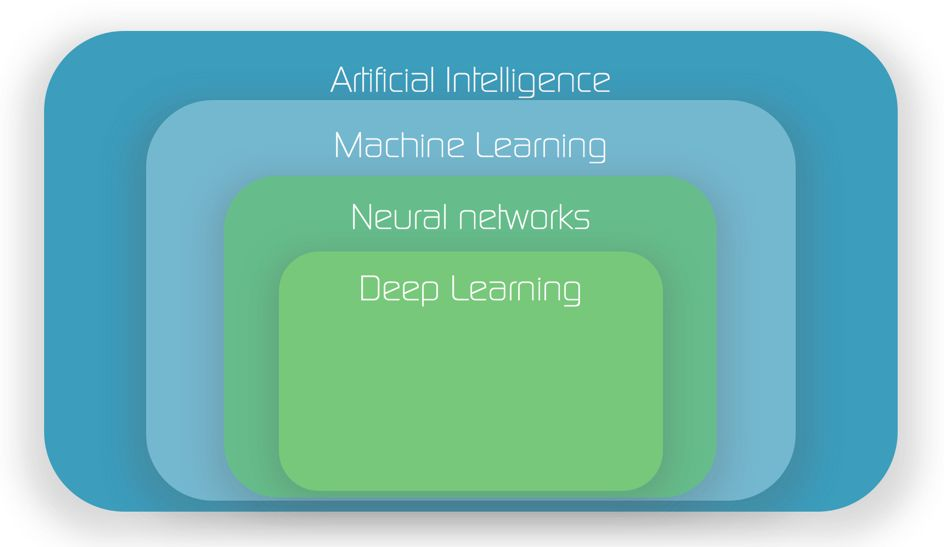

在这三者中，机器学习的涉及范围是最广的，神经网络次之，深度学习最小。

机器学习包含了神经网络，神经网络中又包含了深度学习。

机器学习专门研究计算机怎样模拟或实现人类的学习行为，而神经网络只是借助了动物的神经系统，只是用计算机实现人类行为的一种手段，因此，神经网络包含于机器学习。

深度学习是神经网络的进阶版，只是在模型结构及优化算法等方面有不同，因此，深度学习应包含于神经网络内。

总结：机器学习中有很多

## 1、机器学习的算法流程

实际上机器学习研究的就是数据科学（听上去有点无聊），下面是机器学习算法的主要流程：主要从1）数据集准备、2）探索性的对数据进行分析、3）数据预处理、4）数据分割、5）机器学习算法建模、6）选择机器学习任务，当然到最后就是评价机器学习算法对实际数据的应用情况如何。

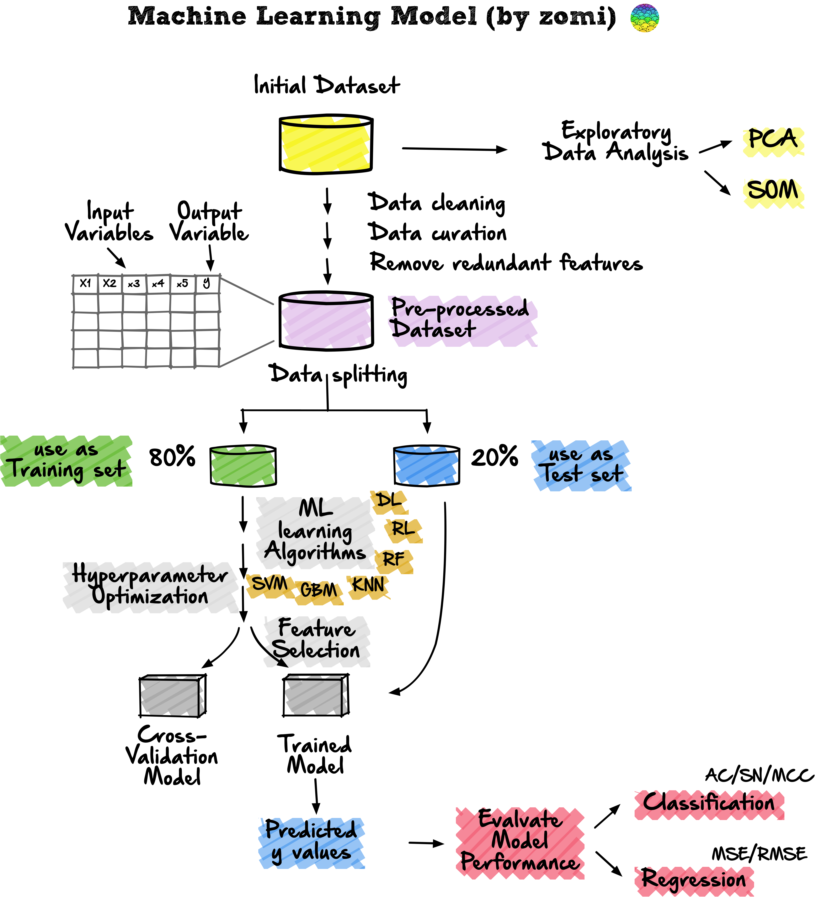

### 1.1 数据集

首先我们要研究的是数据的问题，数据集是构建机器学习模型流程的起点。简单来说，数据集本质上是一个M×N矩阵，其中M代表列（特征），N代表行（样本）。

列可以分解为X和Y，X是可以指特征、独立变量或者是输入变量。Y也是可以指类别标签、因变量和输出变量。

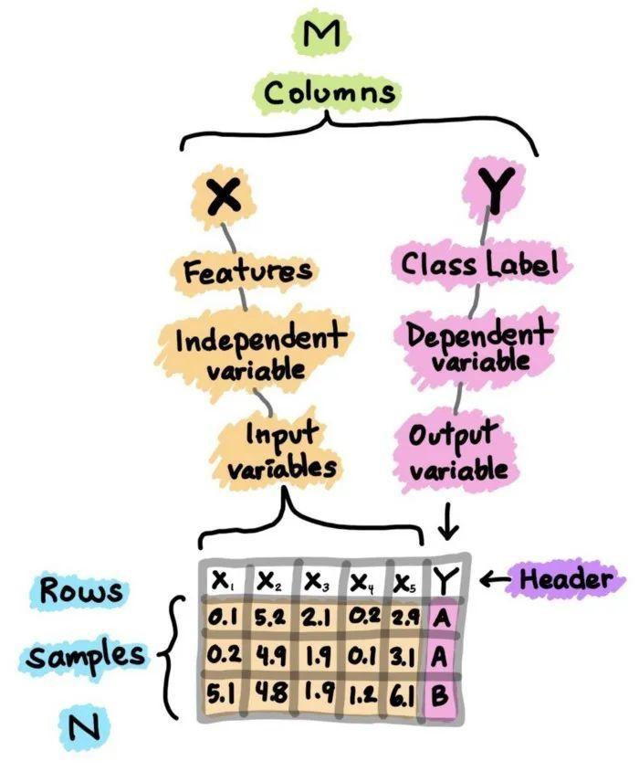

### 1.2 数据分析

进行探索性数据分析（Exploratory data analysis, EDA）是为了获得对数据的初步了解。EDA主要的工作是：对数据进行清洗，对数据进行描述（描述统计量，图表），查看数据的分布，比较数据之间的关系，培养对数据的直觉，对数据进行总结等。

>  探索性数据分析方法简单来说就是去了解数据，分析数据，搞清楚数据的分布。主要注重数据的真实分布，强调数据的可视化，使分析者能一目了然看出数据中隐含的规律，从而得到启发，以此帮助分析者找到适合数据的模型。
>

在一个典型的机器学习算法流程和数据科学项目里面，我做的第一件事就是通过 "盯住数据"，以便更好地了解数据。个人通常使用的三大EDA方法包括：

- **描述性统计**：平均数、中位数、模式、标准差。

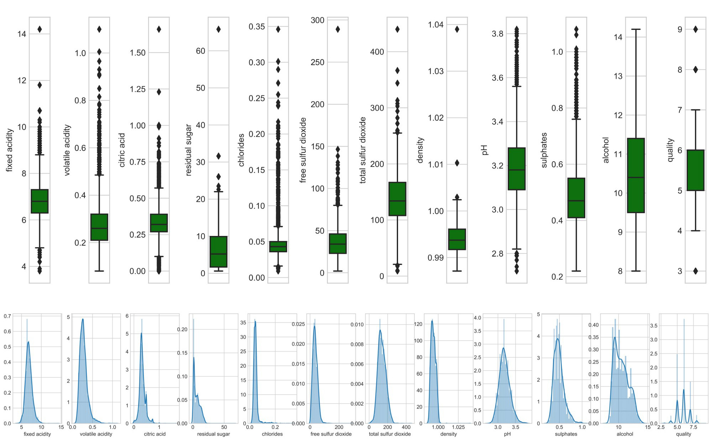

- **数据可视化**：热力图（辨别特征内部相关性）、箱形图（可视化群体差异）、散点图（可视化特征之间的相关性）、主成分分析（可视化数据集中呈现的聚类分布）等。

- **数据整形**：对数据进行透视、分组、过滤等。

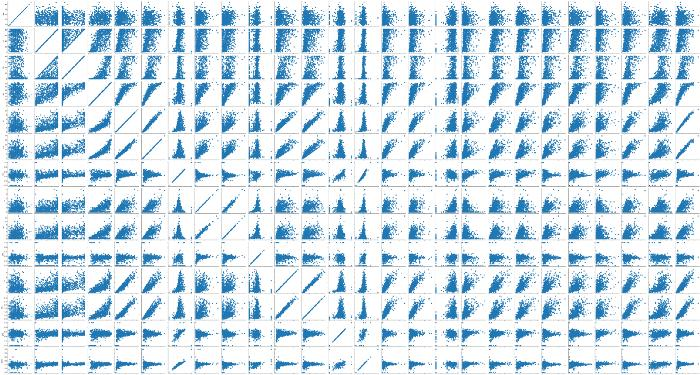

### 1.3 数据预处理

[数据预处理](https://www.zhihu.com/search?q=数据预处理&search_source=Entity&hybrid_search_source=Entity&hybrid_search_extra={"sourceType"%3A"answer"%2C"sourceId"%3A2305409944})，其实就是对数据进行清理、数据整理或普通数据处理。指对数据进行各种检查和校正过程，以纠正缺失值、拼写错误、使数值正常化/标准化以使其具有可比性、转换数据(如对数转换)等问题。

>  例如对图像进行resize成统一的大小或者分辨率。

数据的质量将对机器学习算法模型的质量好坏产生很大的影响。因此，为了达到最好的机器学习模型质量，传统的机器学习算法流程中，其实很大一部分工作就是在对数据进行分析和处理。

一般来说，数据预处理可以轻松地占到机器学习项目流程中80%的时间，而实际的模型建立阶段和后续的模型分析大概仅占到剩余的20%。

### 1.4 数据分割

**训练集 & 测试集**

在机器学习模型的开发流程中，希望训练好的模型能在新的、未见过的数据上表现良好。为了模拟新的、未见过的数据，对可用数据进行数据分割，从而将已经处理好的数据集分割成2部分：训练集合测试集。

第一部分是较大的数据子集，用作训练集（如占原始数据的80%）；第二部分通常是较小的子集，用作测试集（其余20%的数据）。

接下来，利用训练集建立预测模型，然后将这种训练好的模型应用于测试集（即作为新的、未见过的数据）上进行预测。根据模型在测试集上的表现来选择最佳模型，为了获得最佳模型，还可以进行[超参数优化](https://www.zhihu.com/search?q=超参数优化&search_source=Entity&hybrid_search_source=Entity&hybrid_search_extra={"sourceType"%3A"answer"%2C"sourceId"%3A2305409944})。

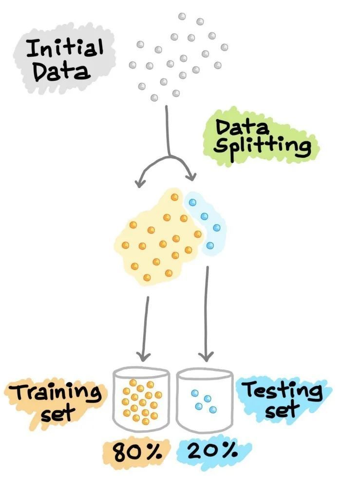

**训练集 & 验证集 & 测试集**

另一种常见的数据分割方法是将数据分割成3部分：1）训练集，2）验证集和3）测试集。

训练集用于建立预测模型，同时对验证集进行评估，据此进行预测，可以进行模型调优（如超参数优化），并根据验证集的结果选择性能最好的模型。

[验证集](https://www.zhihu.com/search?q=验证集&search_source=Entity&hybrid_search_source=Entity&hybrid_search_extra={"sourceType"%3A"answer"%2C"sourceId"%3A2305409944})的操作方式跟训练集类似。不过值得注意的是，测试集不参与机器学习模型的建立和准备，是机器学习模型训练过程中单独留出的样本集，用于调整模型的超参数和对模型的能力进行初步评估。通常边训练边验证，这里的验证就是用验证集来检验模型的初步效果。

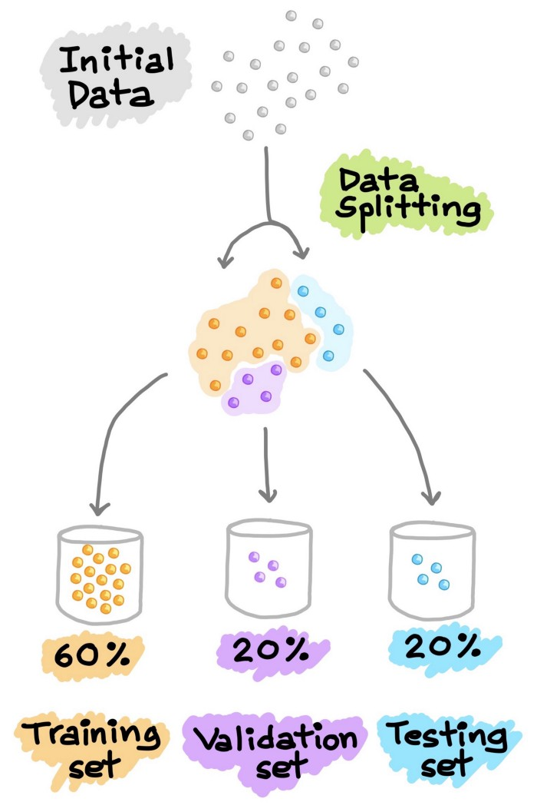

**交叉验证**

实际上数据是机器学习流程中最宝贵的，为了更加经济地利用现有数据，通常使用N倍交叉验证，将数据集分割成N个。在这样的N倍数据集中，其中一个被留作测试数据，而其余的则被用作建立模型的训练数据。通过反复交叉迭代的方式来对机器学习流程进行验证。

>  这种交叉验证的方法在机器学习流程中被广泛的使用，但是深度学习中使用得比较少哈。 

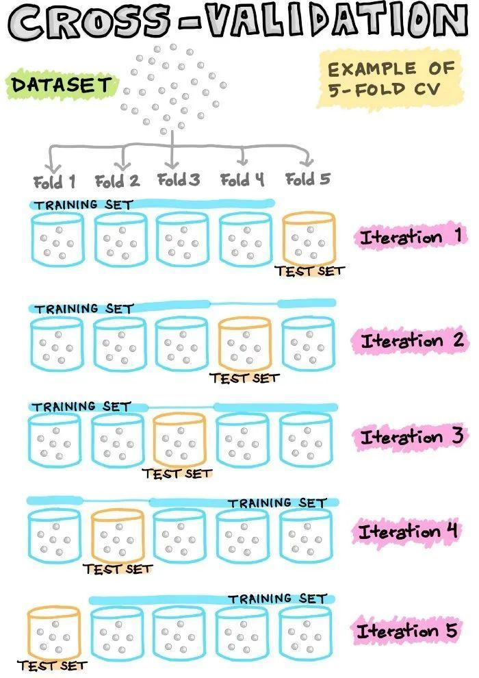

### 以上是对数据集进行的操作

### 以下是机器学习算法的三个基本要素(必不可少)

模型、学习准则和优化算法，提及任何一种机器学习算法都要想到这三个。

### 1.5 机器学习算法建模

下面是最有趣的部分啦，数据筛选和处理过程其实都是很枯燥乏味的，现在可以使用精心准备的数据来建模。根据taget变量（通常称为Y变量）的数据类型，可以建立一个分类或回归模型。

### 机器学习算法

机器学习算法可以大致分为以下三种类型之一：

- **监督学习**：是一种机器学习任务，建立输入X和输出Y变量之间的数学（映射）关系。这样的(X、Y)对构成了用于建立模型的标签数据，以便学习如何从输入中预测输出。
  
- **无监督学习**：是一种只利用输入X变量的机器学习任务。X变量是未标记的数据，学习算法在建模时使用的是数据的固有结构。
  
- **强化学习**：是一种决定下一步行动方案的机器学习任务，它通过试错学习（trial and error learning）来实现这一目标，努力使reward回报最大化。

基本的机器学习算法：线性回归、支持向量机(SVM)、最近邻居(KNN)、逻辑回归、决策树、k平均、随机森林、朴素贝叶斯、降维、梯度增强

模型的概念：模型就是机器学习的结果。通俗概括: 可以从数据中学习到的，可以实现特定功能（映射）的函数。

### 参数调优

超参数和参数的区别：

**参数**是我们训练神经网络 **最终要学习的目标，**最基本的就是神经网络的权重 **W和b**，我们训练的目的，就是要找到一套好的模型参数，用于预测未知的结果。这些参数我们是不用调的，是模型来训练的过程中自动更新生成的。
**超参数**是我们**控制我们模型结构、功能、效率等的调节旋钮**，常见超参数：

- **learning rate**
- epochs(迭代次数，也可称为 num of iterations)
- num of hidden layers(隐层数目)
- num of hidden layer units(隐层的单元数/神经元数)
- **activation function**(激活函数)
- **batch-size**(用mini-batch SGD的时候每个批量的大小)
- **optimizer**(选择什么优化器，如SGD、RMSProp、Adam)
- 用诸如RMSProp、Adam优化器的时候涉及到的β1，β2等等

传说中的调参侠主要干的就是这个工作啦。通常情况下，需要对超参数进行优化，给学习机选择一组最优超参数，以提高学习的性能和效果。**超参数本质上是机器学习算法的参数，直接影响学习过程和预测性能。由于没有万能的超参数设置，可以普遍适用于所有数据集，因此需要进行超参数优化。**

随机森林为例。在使用randomForest时，通常会对两个常见的超参数进行优化，其中包括[mtry](https://www.zhihu.com/search?q=mtry&search_source=Entity&hybrid_search_source=Entity&hybrid_search_extra={"sourceType"%3A"answer"%2C"sourceId"%3A2305409944})和ntree参数。mtry（[maxfeatures](https://www.zhihu.com/search?q=maxfeatures&search_source=Entity&hybrid_search_source=Entity&hybrid_search_extra={"sourceType"%3A"answer"%2C"sourceId"%3A2305409944})）代表在每次分裂时作为候选变量随机采样的变量数量，而ntree（nestimators）代表要生长的树的数量。

另一种在10年前仍然非常主流的机器学习算法是支持向量机SVM。需要优化的超参数是[径向基函数](https://www.zhihu.com/search?q=径向基函数&search_source=Entity&hybrid_search_source=Entity&hybrid_search_extra={"sourceType"%3A"answer"%2C"sourceId"%3A2305409944})(RBF)内核的C参数和gamma参数。C参数是一个限制过拟合的惩罚项，而[gamma参数](https://www.zhihu.com/search?q=gamma参数&search_source=Entity&hybrid_search_source=Entity&hybrid_search_extra={"sourceType"%3A"answer"%2C"sourceId"%3A2305409944})则控制RBF核的宽度。

调优通常是为了得出超参数的较佳值集，很多时候不要去追求找到超参一个最优值，其实调参侠只是调侃调侃，真正需要理解掌握算法原理，找到适合数据和模型的参数就可以啦。

### 特征选择

在选择了一个具体的机器学习算法之后，我们要进行特征选择。

#### 什么是特征选择？

在现实生活中，一个对象往往具有很多属性（以下称为特征），这些特征大致可以被分成三种主要的类型：

1. 相关特征：对于学习任务（例如分类问题）有帮助，可以提升学习算法的效果；
2. 无关特征：对于我们的算法没有任何帮助，不会给算法的效果带来任何提升；
3. 冗余特征：不会对我们的算法带来新的信息，或者这种特征的信息可以由其他的特征推断出；

特征选择从字面上看就是从最初的大量特征中选择一个特征子集的过程。对于一个特定的学习算法来说，哪一个特征是有效的是未知的。因此，需要从所有特征中选择出对于学习算法有益的相关特征。而且在实际应用中，经常会出现维度灾难问题，尤其是在文本处理中。例如，可以把一篇文档表示成一个词向量，但是往往会使用所有的单词作为字典，因此对于一篇可能仅仅包含100或者200个单词的文档，可能需要上万的维度（也就是特征）。如果可以从中选择一部分相关特征构建模型，这个问题就可以得到一定程度的解决。所以，特征选择和降维有一定的相似之处。另外，从上面的例子中可以发现，如果只选择所有特征中的部分特征构建模型，那么可以大大减少学习算法的运行时间，也可以增加模型的可解释性。 

因此，进行特征选择的主要目的：

1. 降维
2. 降低学习任务的难度
3. 提升模型的效率

 特征选择想要做的是：选择尽可能少的子特征，模型的效果不会显著下降，并且结果的类别分布尽可能的接近真实的类别分别。

除了实现高精度的模型外，机器学习模型构建最重要的一个方面是获得可操作的见解，为了实现这一目标，能够从大量的特征中选择出重要的特征子集非常重要。也就是通过特征选择可以提高模型的可解释性，即我们在进行了特征选择之后，可以通过分析子特征来解释我们的模型为什么能够推断出正确的结论。这个过程好像是深度学习里的从自动提取特征，提取特征中的有用信息(即压缩过程)。

特征选择的任务本身就可以构成一个全新的研究领域，在这个领域中，大量的努力都是为了设计新颖的算法和方法。从众多可用的特征选择算法中，一些经典的方法是基于模拟退火和遗传算法。除此之外，还有大量基于进化算法（如粒子群优化、蚁群优化等）和随机方法（如蒙特卡洛）的方法。

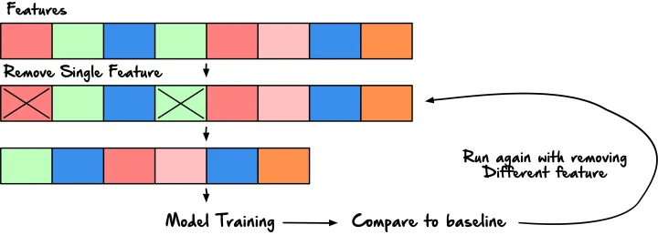

### 1.6 机器学习任务

在监督学习中，两个常见的机器学习任务包括分类和回归。

### 分类

一个训练好的分类模型将一组变量作为输入，并预测输出的类标签。下图是由不同颜色和标签表示的三个类。每一个小的彩色球体代表一个数据样本。三类数据样本在二维中的显示，这种可视化图可以通过执行PCA分析并显示前两个主成分（PC）来创建；或者也可以选择两个变量的[简单散点图](https://www.zhihu.com/search?q=简单散点图&search_source=Entity&hybrid_search_source=Entity&hybrid_search_extra={"sourceType"%3A"answer"%2C"sourceId"%3A2305409944})可视化。

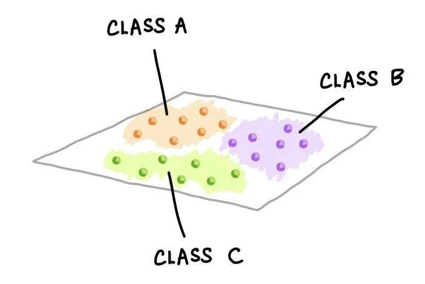

**性能指标**

如何知道训练出来的机器学习模型表现好或坏？就是使用性能评价指标（metrics），一些常见的评估分类性能的指标包括准确率（AC）、灵敏度（SN）、特异性（SP）和马太相关系数（MCC）。

### 回归

最简单的回归模式，可以通过以下简单等式很好地总结：Y = f(X)。其中，Y对应量化输出变量，X指输入变量，f指计算输出值作为输入特征的映射函数（从机器学习模型中得到）。上面的回归例子公式的实质是，如果X已知，就可以推导出Y。一旦Y被计算（预测）出来，一个流行的可视化方式是将实际值与预测值做一个简单的散点图，如下图所示。

对回归模型的性能进行评估，以评估拟合模型可以准确预测输入数据值的程度。评估回归模型性能的常用指标是确定系数（R²）。此外，均方误差（MSE）以及均方根误差（RMSE）也是衡量残差或预测误差的常用指标。

机器学习大概流程：

对数据集进行处理，根据自己对模型的要求选择合适的算法，优化超参数，手动进行特征选择，进行训练调整参数。

## 2、深度学习算法流程

深度学习实际上是机器学习中的一种范式，所以他们的主要流程是差不多的。深度学习则是优化了数据分析，建模过程的流程也是缩短了，由神经网络统一了原来机器学习中百花齐放的算法。

在深度学习正式大规模使用之前呢，机器学习算法流程中药花费很多时间去收集数据，然后对数据进行筛选，尝试各种不同的特征提取机器学习算法，或者结合多种不同的特征对数据进行分类和回归。

下面是机器学习算法的主要流程：主要从1）数据集准备、2）数据预处理、3）数据分割、4）定义[神经网络模型](https://www.zhihu.com/search?q=神经网络模型&search_source=Entity&hybrid_search_source=Entity&hybrid_search_extra={"sourceType"%3A"answer"%2C"sourceId"%3A2305409944})，5）训练网络。

深度学习不需要我们自己去提取特征，而是通过神经网络自动对数据进行高维抽象学习，减少了特征工程的构成，在这方面节约了很多时间。

但是同时因为引入了更加深、更复杂的[网络模型结构](https://www.zhihu.com/search?q=网络模型结构&search_source=Entity&hybrid_search_source=Entity&hybrid_search_extra={"sourceType"%3A"answer"%2C"sourceId"%3A2305409944})，所以调参工作变得更加繁重啦。例如：定义神经网络模型结构、确认损失函数、确定优化器，最后就是反复调整模型参数的过程。

