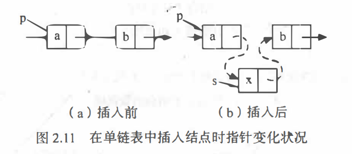

对线性表的一些操作


### 对数组的一些操作

#### 创建数组

先看数据元素是什么类型的，需不需要自定义结构体类型

1. 创建动态数组
2. 创建静态数组

#### 取值

根据位置序号$i$，获取第$i$个位置的元素值。直接用 下标运算符 $[ ]$ 就可以了

#### 查找

根据元素值找位置。for循环遍历一遍就可以了

查找算法的运行时间的评估准则：平均查找长度(Average Search Length,ASL)

一个查找算法的ASL越大，说明时间性能差，反之，时间性能好

平均查找长度的定义：**在查找运算中，由于所费时间在关键字的比较上，所以把 需要和待查找值比较的关键字次数的平均值 称为平均查找长度。**
$$
ASL=\sum_{i=1}^{n}p_ic_i
$$
在公式中，n表示在这n个数里面查找，$p_i$为查找第i个元素的概率，通常假设每个元素查找概率相同，$p_i=\frac{1}{n}$，$c_i$是找到第$i$个元素时已经比较的次数。

在for循环数组中，我们是按照顺序遍历查找的，如果我们在第$x（x \leq n）$个元素时找到了待查找值，那么$ASL_{成功}$的值是多少呢？


所以该查找算法的时间复杂度是$O(n)$

这个东西我现在还是不理解，放着吧。

#### 插入

在某个位置插入某个元素，需要把插入位置及其后面的元素都后移一个位置，然后插进去。这个比较复杂。

#### 删除

在某个位置删除某个元素，用后面的元素一一覆盖前面的元素，也比较复杂。

### 对单链表的一些操作

#### 创建单链表

先创建一个结点指针，作为头指针；如果你不需要头结点，那么创建一个头指针就ok了，等着new首元结点，然后把头结点指向首元结点就可以了。如果你需要头结点，那么在创建头结点之后，new一个结点，不管数据域，指针指向NULL，然后把头指针指向头结点就可以了，之后就等着new首元节点，然后让头结点的指针指向首元节点

创建单链表可以分为前插法和后插法。挺简单的，不写了。

#### 取值

根据位置序号$i$，获取第$i$个位置的元素值。这个比数组取值麻烦，要for循环和计数器。

#### 查找

根据元素值找位置。这个跟数组一样，都是顺序查找。

#### 插入

这个比数组简单，直接new一个结点之后，改一改指针就可以了

#### 删除


比插入还简单，只要执行 `p->next = p->next->next` 就ok了

### 循环链表

相较于单链表而言，唯一的区别就是没有把最后一个结点的指针置NULL,而是让它指向了头结点或首元结点。遍历的时候把循环结束的条件由 `p->next != NULL`或 `p!= NULL`改成了 `p->next != L`或 `p != L` （L是头指针）

### 双向链表

跟单链表比，多了一个指针，多出来的这个指针指向它前面的一个元素。

```cpp
typedef struct line{
    struct line * prior; //指向直接前趋
    elemType data;
    struct line * next; //指向直接后继
}line;
```


先创建一个头指针，如果不需要头结点，等着new结点就行了；如果需要头结点，就new一个头结点，不管数据域，两个指针置为NULL，等着new结点就行了。


头结点很有用，但是我懒得总结了。