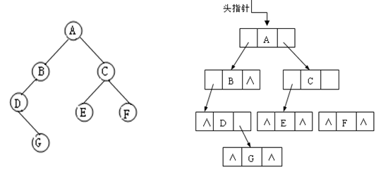
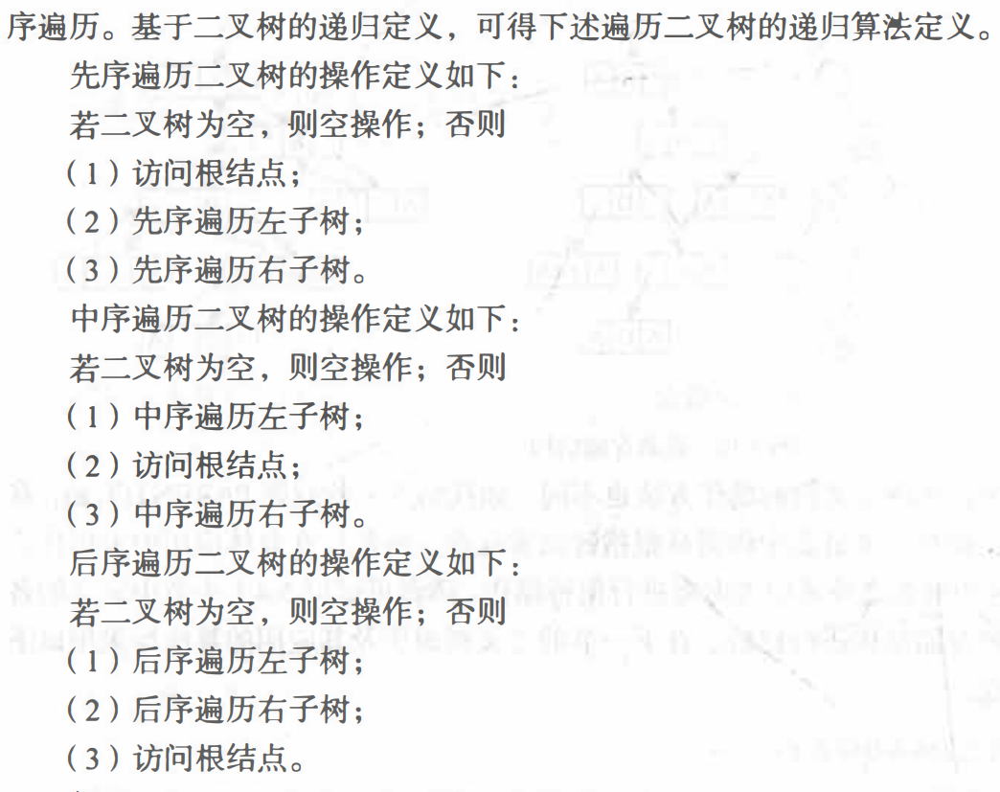
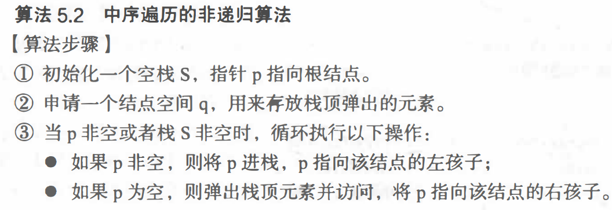
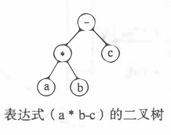
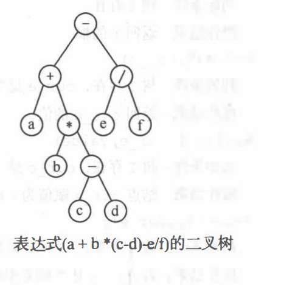
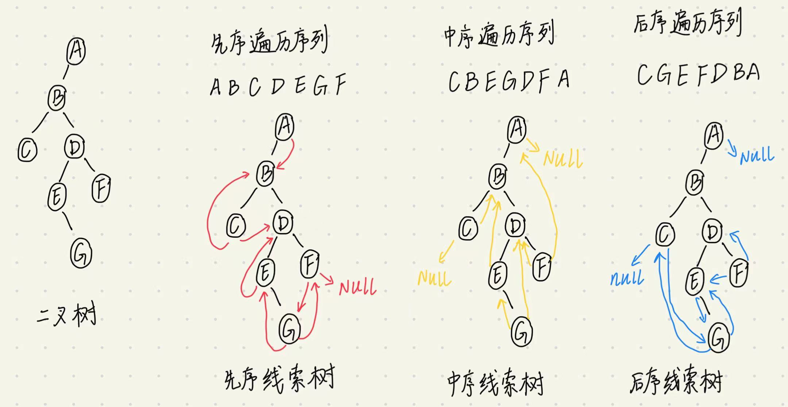
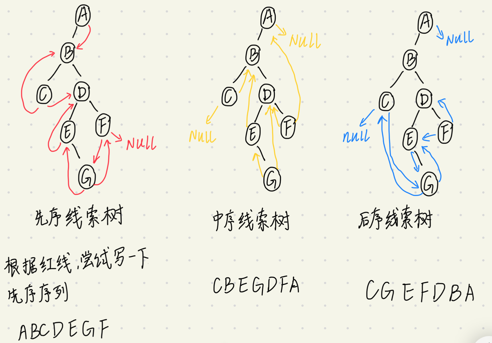
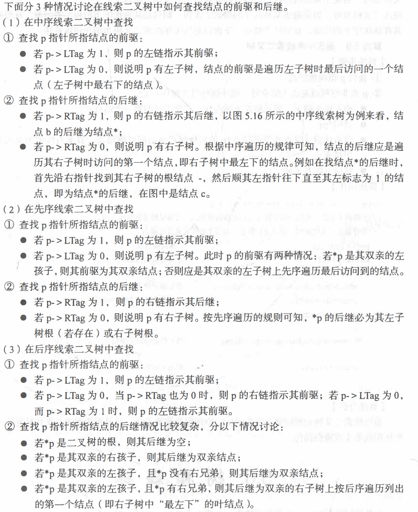

链式存储



```cpp
struct Node{       //结点的结构定义
	int data;
	Node* lchild;
	Node* rchild; 
};
```

data域存放某结点的数据信息；lchild与rchild分别存放指向左孩子和右孩子的指针，当左孩子或右孩子不存在时，相应指针域值为空（用符号∧或NULL表示）。利用这样的结点结构表示的二叉树的链式存储结构被称为**二叉链表。**

### 对二叉树的操作

#### 遍历

分为深度优先遍历和广度优先遍历

深度优先遍历分为递归实现和非递归实现；遍历方式有三种：先序遍历，中序遍历，后序遍历

广度优先遍历，这种方式按照 “从上到下，从左到右＂ 的顺序遍历二叉树， 即先遍历二叉树第一层的结点，然后是第二层的结点，直到最底层的结点， 对每一层的遍历按照从左到右的次序进行。**层次遍历算法的实现可以借助队列这种数据结构**



上面是递归实现。下面是非递归实现。



1. **遍历的一个应用：对用二叉树的链式结构存储的表达式，输出其前缀表示、中缀表示和后缀表示**






因为我只是搞了个框架，具体细节都没有实现，因此，要找一些有关这类的题做一下，然后完善一下具体细节。

2. **遍历的第二个应用：根据遍历序列确定二叉树**

若已知二叉树遍历的任意两种序列，能否确定这棵二叉树呢？这样确定的二叉树是否是唯一的呢？

结论：由二叉树的先序序列和中序序列，或由 其后序序列和中序序列均能唯一地确定一棵二叉树。根据先序序列和后序序列是不能确定一个二叉树的。


  根据定义，二叉树的先序遍历是先访问根结点，其次再按先序遍历方式遍历根结点的左子树，最后按先序遍历方式遍历根结点的右子树。这就是说，在先序序列中，第一个结点一定是二叉树的根结点。另一方面，中序遍历是先遍历左子树，然后访问根结点，最后再遍历右子树。这样，根结点在中序序列中必然将中序序列分割成两个子序列，前一个子序列是根结点的左子树的中序序列， 而后一个子序列是根结点的右子树的中序序列。 根据这两个子序列， 在先序序列中找到对应的左子序列和右子序列。在先序序列中，左子序列的第一个结点是左子树的根结点，右子序列的第一个结点是右子树的根结点。这样，就确定了二叉树的三个结点。同时，左子树和右子树的根结点又可以分别把左子序列和右子序列划分成两个子序列，如此递归下去， 当取尽先序序列中的结点时，便可以得到一棵二叉树。
  同理，由二叉树的后序序列和中序序列也可唯一地确定一棵二叉树。因为，依据后序遍历和中序遍历的定义，后序序列的最后一个结点，就如同先序序列的第一个结点一样，可将中序序列分成两个子序列，分别为这个结点左子树的中序序列和右子树的中序序列，再拿出后序序列的倒数第二个结点，并继续分割中序序列，如此递归下去，当倒着取尽后序序列中的结点时，便可以得到一棵二叉树。

3. **使用遍历算法构造二叉树**

   例如给定一个**含有空结点**的先序序列，根据先序序列构造二叉树。（注意：我们根据遍历算法得到的序列是不含空结点的，因此，单独一个先序序列是不能构造二叉树的，但是含有空结点的先序序列可以唯一确定一棵二叉树)

   详见[6.2.3根据带有空结点的序列构造二叉树.md](./6.2.3根据带有空结点的序列构造二叉树.md)

4. **复制二叉树**

5. **计算二叉树的深度**

6. **统计二叉树中结点的个数**


### 线索二叉树

[数据结构 树和二叉树 考点三 线索二叉树_哔哩哔哩_bilibili](https://www.bilibili.com/video/BV1kd4y1471C/?spm_id_from=333.337.search-card.all.click&vd_source=5a374f315281b0338a0b7fd69b8b8e98)

深度优先遍历二叉树是以一定规则将二叉树中的结点排列成一个线性序列，得到二叉树中结点的先序序列、中序序列或后序序列。这实质上是对一个非线性结构进行线性化操作，使每个结点（除第一个和最后一个外）在这些线性序列中有且仅有一个直接前驱和直接后继。

举个例子理解这句话：


根据上图使用深度优先遍历中的中序遍历，我们可以得到这个二叉树的中序序列。$a+b*c-d-e/f$

由此，我们得到了一个**线性**的序列，这个线性序列除了第一个结点$a$和最后一个结点$f$,其余结点都有一个前驱结点和后继结点，比如$+$的前驱结点是$a$,后继结点是$b$.

当用二叉链表存储二叉树时 ，我们只能找到结点的左、右孩子信息，而不能直接得到结点在这个线性序列中的前驱和后继结点。**但在有些时候，我们希望能直接得到结点在某一遍历序列中的前驱结点和后继结点。**

即我们想把某一遍历序列的顺序信息存放到我们的二叉树中，这样我们就能直接得到结点在该遍历序列中的前驱和后继结点了，我们把存放了这个线性序列的顺序信息的二叉树称之为线索二叉树；

比如说，我有一棵二叉树$A$,根据$A$的中序遍历得到了二叉树$A$的中序序列，然后通过一定的方法(具体怎么操作后面讲)，我把中序序列的顺序信息存放到了二叉树$B$中，我们称二叉树$B$为二叉树$A$的中序线索树。

同理，先序线索树和后序线索树都是这样定义的。

注意：线索二叉树就这三种

线索二叉树如何构造的呢？

首先我们要知道一个性质：具有n个结点的二叉树链表，有n+1个空指针。

比如，只有根结点的二叉树，有两个空指针；有两个结点的二叉树，有三个空指针；有三个结点的二叉树有四个空指针，以此类推，可得上面的结论。

如果我有一个二叉树$A$,这个二叉树有n个结点，那么这个二叉树有n+1个空指针，我们可以将这n+1个空指针利用起来，用这些空指针来存放我们线性序列的顺序信息。如何存放呢？👇

如果一个结点没有左孩子，即左指针为空，我们可以让这个左指针指向 这个结点在线性序列的前驱结点，如果这个结点在线性序列中没有前驱结点，让左指针为空。同理，如果一个结点没有右孩子，即右指针为空，我们可以让这个右指针指向该结点在线性序列中的后继结点，如果这个结点在线性序列中没有后继结点，让右指针为空。

知道了方法之后，请自己找一个二叉树，画出其三种线索二叉树。




其实，这里我是有疑问的，我们只是对空指针进行了操作，让有空指针的结点指向了前驱结点或后继结点，那些*没有空指针的结点* 的前驱和后继的信息并没有保留。也许你会说，那些空指针会指向这些没有空指针的结点的，根据这些也能知道*没有空指针的结点* 的前驱和后继的信息。那是否会存在 *没有空指针的结点* 没有被空指针指向呢？这样的结点既不知道前驱也不知道后继，该怎么办呢？

我并没有尝试过，但是有一种方法，就是根据线索二叉树，我们能否写出其存放的线性序列。如果一直可以的话，那么这种 构造线索二叉树的方法 能存放线性序列全部的顺序信息，否则只能存放线性序列的部分顺序信息。

如果你明白我在说什么的话，根据上图中的线索树尝试一下能不能得到线性序列



确实可以写出来，说明这种 构造线索树 的方法确实可以保存序列的全部顺序信息。


如何实现上面描述的方法呢？

我们修改一下二叉树结点的结构，改成下面这种形式，称之为线索二叉树的结点形式。我们要用这样的结点构造我们的线索二叉树。


```cpp
typedef struct Node
{
    ElemType data;
    struct Node *lchild,*rchild;
    int LTag,RTag;
};
```

可以看出，相较于原二叉树的结点结构，多了两个变量 LTag,RTag;这两个变量相当于两个标志。我们规定，

LTag = 0 表示该结点的左指针指向该结点的左孩子。LTag = 1 表示该结点的左指针指向该结点在线性序列中的前驱结点。

RTag = 0 表示该结点的右指针指向该结点的右孩子。RTag = 1 表示该结点的右指针指向该结点在线性序列中的后继结点。

有人会问，为什么要有这两个标志位？换句话说，这两个标志位如果没有会怎么样？

如果没有的话，给你一个线索二叉树的结点，你怎么知道这个结点的左右指针是指向孩子的还是前驱后继结点的呢？

根据一个二叉树，画出其先序线索树，中序线索树，和后序线索树。


用代码具体实现：根据一个二叉树，构造其先序线索树、中序线索树和后序线索树


**挖坑**


最后一件事：

我们构造线索树的目的是为了能够随机找到一个结点就能很快知道它的前驱结点和后继结点。我们仔细思考一下，对于LTag = 1 和 RTag = 1 的结点能根据左右指针找到该结点的前驱和后继结点；对于LTag = 0 或 RTag = 0 的结点并不能根据其左右指针找到该结点的前驱和后继结点，该怎么办呢？

有人会说，有了线索二叉树之后就能求序列了，那所有结点的前驱和后继不都知道了？太天真了，我们可以直接遍历得到线性序列，何必再构造线索二叉树兜圈子呢，哈哈

**这个我也不会。挖坑了**


