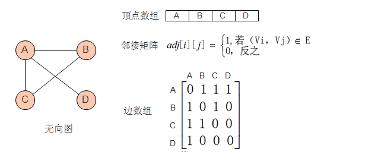

7.1图的存储结构

[数据结构：图(Graph)【详解】_数据结构图_UniqueUnit的博客-CSDN博客](https://blog.csdn.net/Real_Fool_/article/details/114141377)

由于图的结构比较复杂，任意两个顶点之间都可能存在联系，因此无法用数据元素在存储区中的物理位置来表示元素之间的关系，即图没有顺序存储结构，但可以借助二维数组来表示元素之间的关系，即邻接矩阵表示法。另一方面，由于图的任意两个顶点间都可能存在关系，因此，用链式存储表示图是很自然的事，图的链式存储有多种，有邻接表、十字链表和邻接多重表，应根据实际需要的不同选择不同的存储结构。

### 邻接矩阵

想要表示出来图，第一，要明确出来图的所有顶点，第二，顶点之间的相邻关系。

我们用一维数组来存放所有的顶点，用二维数组来存放顶点之间的相邻关系。

一个图有$n$个顶点，我们用一个一维数组来存放所有的顶点，我们把这个一维数组称为顶点数组。为了便于说明,我们定义，$v_i$表示顶点数组中下标为$i$的顶点。

我们用一个$n*n$的二维数组$A$来存放边的信息，我们定义$A[i][j]$只可能取两个值，一个为0，一个为1；当$A[i][j]=0$时表示，从顶点$v_i$和顶点$v_j$之间没有边。当$A[i][j]=1$时表示，从顶点$v_i$和顶点$v_j$之间没有边。

以下是无向图，及其邻接矩阵

性质：

1. 无向图的邻接矩阵一定是一个**对称矩阵**，主对角线的值一定为0，因此，在实际存储邻接矩阵时只需存储上(或下)三角矩阵的元素。
2. 对于无向图，邻接矩阵的第$i$行(或第$i$列)中1的个数正好是第$i$个顶点的度
3. 求顶点$v_i$的所有邻接点就是将矩阵中第i行元素扫描一遍，如果$A[i][j]=1$，那$v_j$就是$v_i$的邻接点。

以下是有向图及其邻接矩阵

性质：

1. 主对角线上数值依然为0。但因为是有向图，所以此矩阵并不对称。
2. 有向图讲究入度与出度，顶点$v_i$的出度为第$i$行1的个数；顶点$v_i$的入度为第$i$列1的个数。

以下是带权图及其邻接矩阵

我们用一个$n*n$的二维数组$A$来存放边的信息，如果从顶点$v_i$到$v_j$有边，则$A[i][j]$存放这条边对应的权值；如果$i == j$,$A[i][j]$存放0；如果没有边,$A[i][j]$存放无穷大($\infty$)

> 记住这种方式就行了，不用问为什么存放无穷大，碰到具体应用的时候就理解了。

### 邻接表

