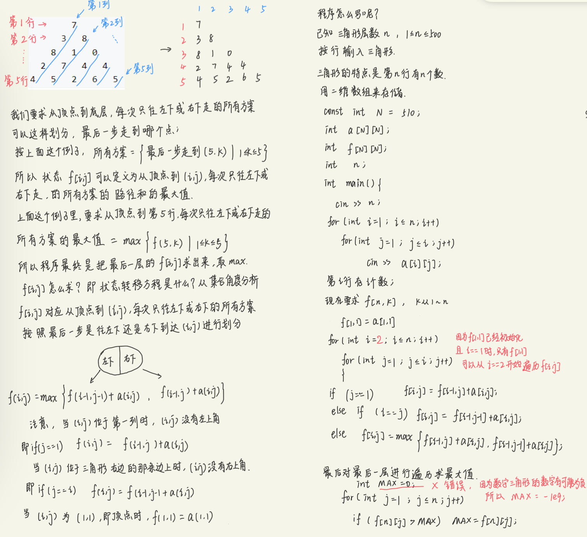

数字三角形




```cpp
#include <iostream>
#include <algorithm>

using namespace std;

const int N = 510;
int a[N][N],f[N][N];
int n;

int main()
{
    cin >> n;
    for(int i = 1; i <= n; i++)
        for(int j = 1; j <= i;j++) cin >> a[i][j];
    f[1][1] = a[1][1];
    for(int i = 2; i <= n; i++)
        for(int j = 1; j<= i; j++)
        {
            if(j == 1) f[i][j] = f[i-1][j]+a[i][j];
            else if(j == i) f[i][j] = f[i-1][j-1]+a[i][j];
            else f[i][j] = max(f[i-1][j]+a[i][j],f[i-1][j-1]+a[i][j]);
        }
    int res = -1e9;
    for(int j = 1; j <= n; j++) res = max(res,f[n][j]);
    cout << res;
}
```

下面是y总的代码，可以看一下y总代码，从而对自己代码进行优化。


```cpp
#include <iostream>
#include <algorithm>

using namespace std;

const int N = 510, INF = 1e9;

int n;
int a[N][N];
int f[N][N];

int main()
{
    scanf("%d", &n);
    for (int i = 1; i <= n; i ++ )
        for (int j = 1; j <= i; j ++ )
            scanf("%d", &a[i][j]);

    for (int i = 0; i <= n; i ++ )
        for (int j = 0; j <= i + 1; j ++ )
            f[i][j] = -INF;

    f[1][1] = a[1][1];
    for (int i = 2; i <= n; i ++ )
        for (int j = 1; j <= i; j ++ )
            f[i][j] = max(f[i - 1][j - 1] + a[i][j], f[i - 1][j] + a[i][j]);

    int res = -INF;
    for (int i = 1; i <= n; i ++ ) res = max(res, f[n][i]);

    printf("%d\n", res);
    return 0;
}

作者：yxc
链接：https://www.acwing.com/activity/content/code/content/58479/
来源：AcWing
著作权归作者所有。商业转载请联系作者获得授权，非商业转载请注明出处。
```

实际中遇到的一些问题，或者解决一些算法问题时，会遇到给某个变量初始化并赋值为1e9。接着后面会出现一些代码计算最小值。
这时，1e9的作用是给变量赋一个初始极大值，原因在于后面的代码中需要取此变量和其他变量的最小值。初始化为一个最大值，亦即初始化为无穷，便于后面极小值的比较和获取，属于初始化的目的。
有时我们需要比较大小，或者在matlab等其语言中为取无穷，我们只需取一个很大的值即可。C++中取1e9，10的九次方就是一种方法，代表一个很大的值。
