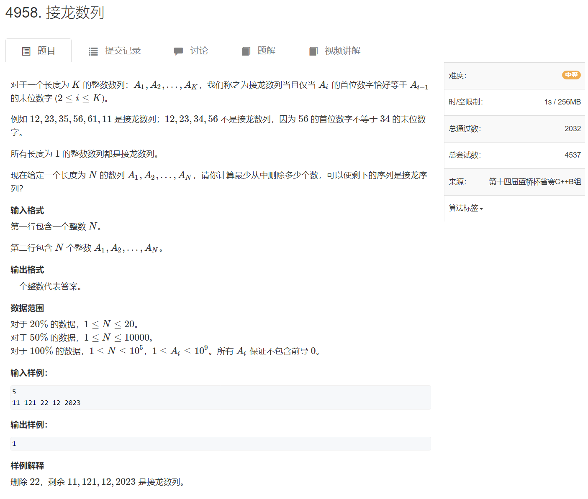

接龙数列

[4958. 接龙数列 - AcWing题库](https://www.acwing.com/problem/content/4961/)




此题与最长公共子序列思路是相同的。

集合表示以 `a[i]`结尾的最长接龙子序列。最后对所有 `f[i]` 取max就是该序列的最长接龙子序列的长度

下面集合的划分是根据以 `a[i]` 结尾的最长接龙子序列的倒数第二位取值进行划分的，倒数第二位的取值是无，a[1],a[2],...,a[i-1] 其中取值为无定义为  初始化f[i] = 1;

```cpp
#include <iostream>
#include <cstdio>
#include <algorithm>

using namespace std;

const int N = 100010;
int a[N],f[N];
int n;

int main()
{
    cin >> n;
    for(int i = 1; i <= n; i++) scanf("%d",&a[i]);
    for(int i = 1; i <= n; i++)
    {
        f[i] = 1; //初始化为1是因为，当前面的元素都不满足a[j]%10 == t的时候，这样的序列只有a[i]一个元素
        int t=a[i];
        while(t >= 10) t /= 10;
        for(int j = 1; j < i; j++)
        {
            if(a[j]%10 == t) f[i] = max(f[i],f[j]+1);
        }
    }
    int res = 0;
    for(int i = 1; i <= n; i++) res = max(res,f[i]);
    cout << n-res;
}
```

根据模板写出来的。

但是这道题如果用模板的话只能过一半的样例，另外一半会超时。需要优化。

