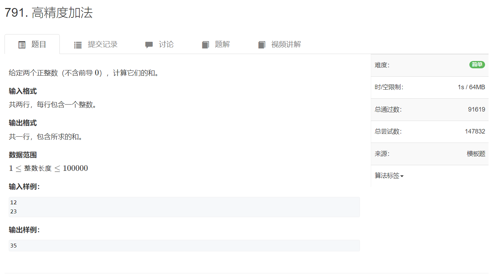

高精度

[算法笔记 (一) 高精度 - 知乎 (zhihu.com)](https://zhuanlan.zhihu.com/p/275011916)

什么是高精度？
高精度算法（High Accuracy Algorithm）是处理大数字的数学计算方法。在一般的科学计算中，会经常算到小数点后几百位或者更多，当然也可能是几千亿几百亿的大数字。一般这类数字我们统称为高精度数，高精度算法是用计算机对于超大数据的一种模拟加，减，乘，除，乘方，阶乘，开方等运算。对于非常庞大的数字无法在计算机中正常存储，于是，将这个数字拆开，拆成一位一位的，或者是四位四位的存储到一个数组中， 用一个数组去表示一个数字，这样这个数字就被称为是高精度数。

**本文将介绍四种常见的高精度计算，包括高精度加法、减法、高精度乘低精度、高精度除低精度。**

[791. 高精度加法 - AcWing题库](https://www.acwing.com/problem/content/793/)



该题中的数的位数最大能达到6位。而我们的 64位无符号整数最大值为 $2^{64}-1$ 约为 1.8e19。也就最多20位。

也就是我们表示不能用计算机来存储了。


模拟加法

```cpp
#include <iostream>
#include <vector>

using namespace std;

vector<int> add(vector<int> &A, vector<int> &B)
{
    vector<int> C;  //存放高精度加法的结果
    int t = 0;
    for (int i = 0; i < A.size() || i < B.size(); i ++ )
    {
        if(i < A.size()) t += A[i];
        if(i < B.size()) t += B[i];
        C.push_back(t % 10);
        t /= 10;    // t存放进位，如果t大于10的话， t / 10 = 1,参加下一位的加法
    }

    if (t) C.push_back(t);
    return C;
}

int main()
{
    string a, b;           //用string来接收高精度数字
    vector<int> A, B;
    cin >> a >> b;
    for (int i = a.size() - 1; i >= 0; i -- ) A.push_back(a[i] - '0');  
    //别忘了ascii转成数字，其次，这是将数字逆序放到vector中，下标0对应数字的最低位，即个位；
    for (int i = b.size() - 1; i >= 0; i -- ) B.push_back(b[i] - '0');

    auto C = add(A, B);

    for (int i = C.size() - 1; i >= 0; i -- ) cout << C[i];
    cout << endl;

    return 0;
}
```


模拟减法

```cpp

```


