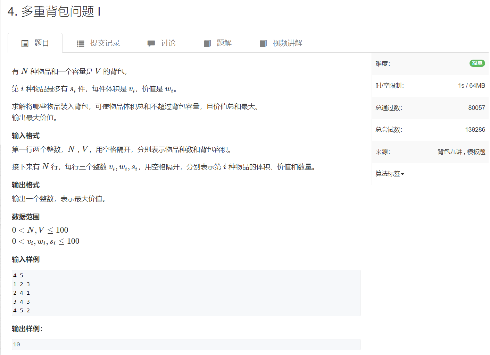

多重背包

有 N种物品和一个容量是 V的背包。

第$i$种物品最多有 $s[i]$件，每件体积是 $v[i]$，价值是$w[i]$。

求解将哪些物品装入背包，可使物品体积总和不超过背包容量，且价值总和最大。输出最大价值。


了解了 01背包 和 完全背包 后 这种问题还是有思路的。





```cpp
#include <iostream>
#include <algorithm>

using namespace std;

const int N = 110;
int n,m;
int v[N],w[N],s[N];
int f[N][N];

int main()
{
    cin >> n >> m;
    for(int i = 1;i <= n;i++) cin >> v[i] >> w[i] >> s[i];
    for(int i = 1;i <= n;i++)
        for(int j = 0;j <= m;j++)
            for(int k = 0;k<=s[i]&& k*v[i] <= j;k++)
                f[i][j] = max(f[i][j],f[i-1][j-k*v[i]]+k*w[i]);
    
    cout << f[n][m];
}
```

这样暴力的解法时间复杂度有点高，不适合写数据范围大的算法题。

有什么优化方法吗？能不能像完全背包那样优化成两部分小集合呢？

这次不能像完全背包问题一样，把 $k = 1,2,3,...,j/v[i]$ 转化为 $k\geq 1$ 了，因为我们这次物品的数量是有限制的，因此上面两种情况对应的集合是不一定等价的。


今天先到这里，不学了，明天继续了。


